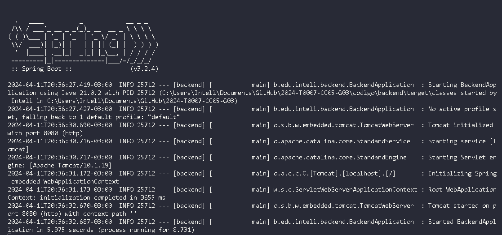
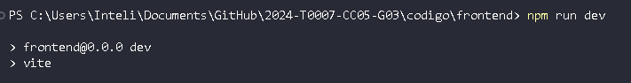

# Repositório do grupo 2024-T0007-CC05-G03

<table>
<tr>
<td>

</td>
<td>
</td>
</tr>
</table>

# Introdução

Este é um dos repositórios do projeto de alunos do Inteli em parceria com a Vale no 1º semestre de 2024. Este projeto está sendo desenvolvido por alunos do Módulo 5 do curso de Ciência da Computação.

# Projeto: Aumento da performance logística na distribuição de minério de ferro

# Grupo: *Dell Vale*

# Integrantes:

* <a href="https://www.linkedin.com/in/ever-felliphe-sousa-da-costa-16001617a?lipi=urn%3Ali%3Apage%3Ad_flagship3_profile_view_base_contact_details%3Buh2pkpCiQJOURyvuyRYuKw%3D%3D">Ever Felliphe</a>
* <a href="https://www.linkedin.com/in/gabriel-pelinsari/">Gabriel Pelinsari</a>
* <a href="https://www.linkedin.com/in/heloisa-cavalcanti-oliveira/">Heloisa Oliveira</a>
* <a href="https://www.linkedin.com/in/hugo-noyma/">Hugo Noyma</a>
* <a href="https://www.linkedin.com/in/leonardokalid/">Leonardo Kalid</a>
* <a href="https://www.linkedin.com/in/pedro-auler-a3b23021a/">Pedro Auler</a>

# Descrição

*O projeto envolve o desenvolvimento de uma plataforma, que tenha como objetivo maximizar o atendimento de ferro dos clientes da Vale, utilizando a modelagem em grafos. Dessa forma, espera-se que, dentro de um espaço de tempo determinado, seja possível decidir o fluxo de minério que deve sair de qual mina para atender a demanda de qual cliente.*

# Configuração de desenvolvimento

*Procedimento para baixar e executar o código deste projeto.*

### Front-end
*Para preparar o front-end, é necessario abrir o terminal na pasta raiz do projet e digitar o seguinte comando:*

*Após isso é necessario utilizar o seguinte comando para baixar as dependências do projeto:*

### Back-end
*Para o backend é necessario instalar o springboot, para isso, no vscode, existe um pacote de extensões que implementam este framework e abstrai todo o processo de rodar o servidor backend, abaixo esta o pacote de extensões citado:*

### iniciar a aplicação
*Para iniciar a aplicação, primeiro será necessário iniciar o backend da aplicação, assim criando um servidor local. Para isso abra a aplicação pelo vsCode e pressione f5 para iniciar o servidor SpringBoot, abaixo está o output esperado para um servidor funcionando:*

*A partir de agora o servidor estará pronto para receber requisições e lidar com elas. Sendo assim o frontend poderá ser iniciado sem problemas e terá suas funcionalidades operacionais.*
*Para iniciar o frontend da aplicação é necessario digitar o seguinte comando no diretório /frontend :*

*A partir deste ponto a aplicação estará pronta para uso. Para acessa-la acesse o link retornado pelo comando anterior, ou digite http://localhost:5173/ no navegador.*

# Releases

* SPRINT 1 - 15/02/2024:
    - *Entendimento da Experiência do Usuário*;
    - *Entendimento do Contexto do Problema*; 
    - *Entendimento do Negócio*;
* SPRINT 2: 29/02/2024:
    - *Artigo - versão inicial*;
    - *Classes de domínio do problema*;
    - *Repositório do Código*;
* SPRINT 3: 14/03/2024:
    - *Front-end da Aplicação*;
    - *Aprimoramento do Artigo*;
    - *Criação da Estrutura de Dados*;
    - *Implementação dos Algoritmos de Fluxo máximo*;
* SPRINT 4:
    - *Integração da Aplicação (Front-end e algoritmos)*;
    - *Análise de Complexidade e Completude - Artigo*;
    - *Apresentação de Resultados e Conclusões - Artigo*;
    - *Documentação e melhoria do repositório*;
* SPRINT 5: 11/04/204
    - *Refinamento da aplicação*;
    - *Artigo completo*;
    - *Apresentação final*;
    - *Refinamento e validação dos artefatos de negócio*;

## 📋 Licença/License

<a property="dct:title" rel="cc:attributionURL">Dell Vale</a> by <a rel="cc:attributionURL dct:creator" property="cc:attributionName">Inteli, <a href="https://www.linkedin.com/in/ever-felliphe-sousa-da-costa-16001617a?lipi=urn%3Ali%3Apage%3Ad_flagship3_profile_view_base_contact_details%3Buh2pkpCiQJOURyvuyRYuKw%3D%3D">Ever Felliphe</a>, <a href="https://www.linkedin.com/in/gabriel-pelinsari/">Gabriel Pelinsari</a>, <a href="https://www.linkedin.com/in/heloisa-cavalcanti-oliveira/">Heloisa Oliveira</a>, <a href="https://www.linkedin.com/in/hugo-noyma/">Hugo Noyma</a>, <a href="https://www.linkedin.com/in/leoardokalid">Leonardo Kalid</a>, <a href="https://www.linkedin.com/in/pedro-auler-a3b23021a/">Pedro Auler</a></a> is licensed under <a href="https://creativecommons.org/licenses/by/4.0/" rel="license noopener noreferrer" style="display:inline-block;">Attribution 4.0 International</a>.

