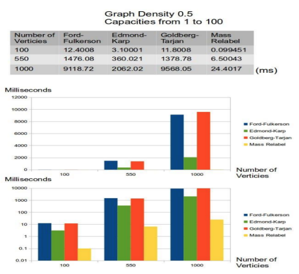

# Complexidade e corretude do algoritmo

# 1.0 Adequação da Estrutura de Dados

&emsp;Primeiramente, os dados recebidos pela empresa parceira, Vale, foram analisados e estudados pela equipe Dell Vale com o objetivo de entender o comportamento dessa malha logístca. Contudo, para utilizá-los nos algoritmos de fluxo máximo, foi necessário realizar um tratamento na linguagem Python afim de entender melhor os dados, juntos do auxiílio de classes que extraiam os dados do XML da Vale, as quais levaram a identificar as classes e features mais importantes para o projeto.

# 2.0 Implementação do algoritmo

&emsp;Concluído o tratamento inicial dos dados, foram construídas classes que representassem os algoritmos de fluxo máximo. Por motivos de comparação e melhor obtenção de resultados, o grupo Dell Vale implementou 3 algoritmos dos descritos na seção 1.7 do entendimento do contexto do problema: Ford-Fulkerson, Edmonds-Karp e Goldberg-Tarjan. Contudo, para fins de avaliação, somente foi testado o algoritmo de Goldberg-Tarjan, que possui complexidade de O(V²E) e, portanto, espera-se uma performance melhor em relação aos demais. O arquivo de teste pode ser encontrado na pasta "codigo" e "Algoritmos" deste repositório.

&emsp;Nesse sentido, não foram realizadas nenhuma alteração significativa na lógica de implementação desse algoritmo para se adequar aos dados disponíveis, os quais os testes foram bem sucedidos, ou seja, é retornado o valor correto de fluxo máximo para os grafos.

&emsp;A seguir estão detalhes das implementações dos 2 algoritmos utilizados pela equipe, o algoritmo de Edmonds-Karp e o de Goldberg-Tarjan(push-relabel):
## 2.1 Edmonds Karp

&emsp;O Algoritmo de Edmonds-Karp constitui uma variante eficaz do Algoritmo de Ford-Fulkerson, desenvolvido especificamente para resolver o problema do fluxo máximo em redes de fluxo. Este algoritmo se destaca por empregar a busca em largura (BFS) na identificação do caminho de aumento mais curto. Essa característica não apenas facilita a descoberta de um caminho de aumento, mas também assegura a eficiência do algoritmo, confinando o número de iterações a um espectro polinomial em relação à quantidade de vértices no grafo.

## Descrição do Algoritmo

### Definições Fundamentais

- **Rede de Fluxo:** Considera-se um grafo direcionado $G = (V, E)$, onde cada aresta $(u, v) \in E$ é associada a uma capacidade $c(u, v) \geq 0$ e a um fluxo $f(u, v)$. Esse grafo é dotado de uma fonte $s$ e um sumidouro $t$.
- **Fluxo Máximo:** Define-se como o fluxo máximo o maior valor de fluxo que é possível enviar da fonte $s$ ao sumidouro $t$, sem que haja a superação das capacidades das arestas.

### Operação Principal

&emsp;O algoritmo de Edmonds-Karp distingue-se do Ford-Fulkerson pela aplicação da busca em largura (BFS) para determinar o **caminho de aumento mais curto** em termos de contagem de arestas. Esta metodologia não somente localiza um caminho de aumento eficazmente, mas também garante a finalização do algoritmo em um número polinomial de etapas, otimizando a performance e a aplicabilidade do mesmo.

## 2.2 Goldberg Tarjan(Push Relabel)

&emsp;O Algoritmo de Goldberg-Tarjan, ou algoritmo de pré-fluxo e empurrar-relabel, apresenta uma técnica eficiente para resolver o problema de fluxo máximo em redes de fluxo. Diferente da abordagem baseada em caminhos de aumento usada por Ford-Fulkerson, o Goldberg-Tarjan trabalha inicializando um pré-fluxo que excede as demandas dos vértices e ajusta progressivamente esses fluxos até atingir um estado de fluxo máximo.

## Descrição do Algoritmo

### Definições Iniciais

 - Uma rede de fluxo é definida por um grafo direcionado $G = (V, E)$, onde cada aresta $(u, v) \in E$ tem uma capacidade $c(u, v) \geq 0$ e um fluxo $f(u, v)$, com uma fonte $s$ e um sumidouro $t$.
- Diferentemente do algoritmo de Ford-Fulkerson e Edmonds-Karp, o Goldberg-Tarjan introduz o conceito de altura para cada vértice e de pré-fluxo, que permite temporariamente que o fluxo entrante em um vértice exceda o fluxo saínte.

### Operação Principal

&emsp;O algoritmo opera em duas fases principais: **empurrar** (push) e **relabel** (relabel). Na fase de empurrar, se tenta enviar o excesso de pré-fluxo de um vértice para seus vizinhos downstream. Se isso não for possível, o algoritmo relabela o vértice, aumentando sua altura para criar uma nova oportunidade de empurrar o pré-fluxo.

# 3.0 Analise de Complexidade dos Algoritmos

## 3.1 Edmonds Karp

Figura 1: Análise de Complexidade

  

Fonte: EDMONDS-KARP AND DINIC’S ALGORITHMS FOR MAXIMUM FLOW. Top Coder, [s. l.], 7 jan. 2022. Disponível em: https://www.topcoder.com/thrive/articles/edmonds-karp-and-dinics-algorithms-for-maximum-flow. Acesso em: 27 mar. 2024.

   
&emsp;A complexidade de tempo do Algoritmo de Edmonds-Karp, uma implementação específica do método Ford-Fulkerson para encontrar o fluxo máximo em uma rede, pode ser expressa utilizando as notações de complexidade tradicionais: $O$ (big O), $ \Omega $ (big Omega) e $\Theta$ (big Theta).

#### Pior Caso $O(VE^2)$:
 
 &emsp;Onde $V$ é o número de vértices e $E$ é o número de arestas na rede. Isso se dá porque o algoritmo pode precisar de examinar todas as arestas em cada uma das $V$ iterações de aumento do fluxo, e em cada iteração, a verificação de caminhos de aumento pode necessitar de uma exploração que é proporcional ao quadrado do número de arestas.

#### Melhor Caso: $\Omega(E)$
 
 &emsp;Este cenário ocorre sob condições ideais em que cada incremento no fluxo pode ser conseguido com uma única passagem pelas arestas, sem a necessidade de revisitar ou examinar múltiplas vezes as mesmas arestas ou vértices. Isso assume uma situação altamente otimizada e pouco comum, onde a topologia da rede e as capacidades das arestas permitem que cada aresta contribua para o aumento do fluxo logo na primeira tentativa.

#### Caso Médio $\Theta(VE^2)$: 

&emsp;Dado o comportamento do algoritmo e as características variadas das redes nas quais pode ser aplicado, o caso médio tende a se aproximar do pior caso, sendo assim expresso como $\Theta(VE^2)$. Isto reflete o entendimento de que, enquanto em redes específicas e sob certas condições o algoritmo pode performar melhor do que o pior caso teórico, na maioria das situações e especialmente em redes grandes e complexas, a complexidade tende a se manter próxima do limite superior estabelecido pelo pior caso.

## 3.2 Goldberg Tarjan(Push-Relabel)

&emsp;A complexidade temporal do algoritmo Goldberg-Tarjan é $O(V^2E)$, sendo uma melhoria significativa sobre o pior caso do algoritmo Ford-Fulkerson, principalmente para redes densas.

# 4.0 Analise de corretude

## 4.1 Edmonds Karp

### Entendimento do Propósito do Algoritmo:

&emsp;Antes de analisarmos a correção do algoritmo Edmonds-Karp utilizando a técnica de prova por indução, é essencial entender seu objetivo. O algoritmo de Edmonds-Karp é uma implementação específica do algoritmo de Ford-Fulkerson para calcular o fluxo máximo em uma rede de fluxo. Seu propósito é encontrar o máximo fluxo de um vértice fonte $s$ para um vértice sorvedouro $t$ em um grafo direcionado, onde cada aresta tem uma capacidade de fluxo não negativa. Isso é feito repetidamente encontrando caminhos de aumento - caminhos onde o fluxo adicional pode ser enviado da fonte ao sorvedouro - até que nenhum desses caminhos exista mais.

#### Invariante do Laço:
&emsp;Durante a execução do algoritmo, mantém-se um invariante de laço: a cada iteração, o algoritmo aumenta o fluxo total do sistema enquanto existe um caminho de aumento da fonte ao sorvedouro. Isso é conseguido atualizando as capacidades residuais das arestas no caminho de aumento encontrado.

&emsp;Para demonstrar a corretude do algoritmo Edmonds-Karp, definiremos algumas notações e propriedades-chave.

&emsp;Notações:

&emsp;$G(V,E)$ é o grafo que representa a rede de fluxo, onde $V$ é o conjunto de vértices e $E$ é o conjunto de arestas.
- $c(u, v)$ é a capacidade de fluxo da aresta do vértice $u$ para o vértice $v$.
- $f(u, v)$ é o fluxo atual na aresta de $u$ para $v$.
- $G_f(V, E_f)$ é o grafo residual, onde $E_f$ são as arestas com capacidades residuais positivas.
- $p$ é um caminho de aumento no grafo residual $G_f$.

Propriedades:

1. **Capacidade Residual:** Para cada aresta $(u, v) \in E$, a capacidade residual é definida como $c_f(u, v) = c(u, v) - f(u, v)$. Isso representa a capacidade de fluxo adicional que pode ser enviado de $u$ para $v$.

2. **Caminho de Aumento:** Um caminho de aumento é um caminho no grafo residual $G_f$ da fonte $s$ ao sorvedouro $t$, onde todas as arestas têm capacidade residual positiva. Enviar fluxo ao longo de um caminho de aumento aumenta o fluxo total da rede.

3. **Terminação:** O algoritmo termina quando não há mais caminhos de aumento no grafo residual, o que significa que o fluxo máximo foi alcançado.

#### Prova de Corretude:

**Hipótese de Indução:**
Assumimos que, após cada iteração do algoritmo, o fluxo $f$ é um fluxo válido da fonte ao sorvedouro, e não existem caminhos de aumento que permitam um fluxo maior sem violar as capacidades das arestas.

**Base da Indução:**
Inicialmente, o fluxo $f$ é zero em todas as arestas, o que claramente satisfaz as condições de fluxo válido. Isso serve como nossa base de indução.

**Passo da Indução:**
Suponha que antes da iteração $i$ do algoritmo, o fluxo $f$ é um fluxo válido. Durante a iteração $i$, um caminho de aumento $p$ é encontrado no grafo residual $G_f$, e o fluxo é aumentado ao longo desse caminho.

1. **Manutenção do Fluxo Válido:** O fluxo é atualizado ao longo de $p$ aumentando $f$ nas arestas diretas de $p$ e diminuindo $f$ nas arestas inversas, garantindo que as capacidades das arestas não sejam violadas. Isso mantém a propriedade de que $f$ é um fluxo válido de $s$ a $t$.

2. **Aumento do Fluxo Total:** Ao enviar fluxo adicional ao longo de $p$, o fluxo total da rede aumenta. Isso está de acordo com nossa hipótese de indução, onde cada iteração aumenta o fluxo total até que nenhum caminho de aumento seja encontrado.

3. **Terminação e Máximo Fluxo:** Quando não há caminhos de aumento restantes, o fluxo $f$ não pode ser aumentado sem violar as capacidades das arestas. Isso significa que alcançamos o fluxo máximo possível de $s$ para $t$, provando que o algoritmo termina corretamente com o fluxo máximo.

&emsp;Portanto, por indução, mostramos que o algoritmo Edmonds-Karp aumenta corretamente o fluxo total a cada iteração, mantendo a validade do fluxo, e termina com o fluxo máximo de $s$ a $t$. Isso prova a corretude do algoritmo Edmonds-Karp.

## 4.2 Goldberg Tarjan(Push-Relabel)

## Invariante do Algoritmo
&emsp;O algoritmo mantém dois invariantes durante sua execução:

&emsp;Pré-fluxo: Em qualquer momento, o pré-fluxo é tal que o fluxo entrante pode exceder o fluxo saínte, mas nunca o contrário.
&emsp;Alturas: As alturas dos vértices são usadas para direcionar o pré-fluxo e são ajustadas para manter o gradiente decrescente do fluxo da fonte ao sumidouro.

### Demonstração Formal da Corretude

&emsp;A corretude do algoritmo de Goldberg-Tarjan é garantida se, ao final da execução, o pré-fluxo se converte em um fluxo válido que é máximo. A demonstração formal por indução abordará esses aspectos:

### Base da Indução

**Passo Base:** No início, somente a fonte $s$ tem um pré-fluxo, sendo este distribuído completamente para seus vizinhos. As alturas são inicializadas de forma que $s$ tem altura $|V|$ e todos os outros vértices têm altura $0$. Este é um estado válido de pré-fluxo.

#### Hipótese Indutiva

**Passo Indutivo:** Assuma que após $k$ operações (empurrar ou relabel), o estado de pré-fluxo e as alturas dos vértices garantem que o fluxo ainda é um pré-fluxo válido, respeitando a capacidade das arestas e a condição de altura para operações de empurrar.

#### Passo Indutivo

1. **Operação de Empurrar:** Se um vértice $u$ tem excesso de pré-fluxo e há uma aresta $(u, v)$ tal que a altura de $u$ é exatamente um a mais que a de $v$, o pré-fluxo pode ser empurrado para $v$. Isso reduz o excesso em $u$ sem violar as condições de pré-fluxo ou altura.

2. **Operação de Relabel:** Se não é possível empurrar o pré-fluxo de $u$ por falta 
de arestas adequadas, então $u$ é relabelado. Isso aumenta a altura de $u$ para o mínimo necessário que permita potencialmente um empurrar futuro. A altura é ajustada para ser um a mais que a menor altura entre os vizinhos de $u$ para os quais o empurrar é possível de acordo com a capacidade residual.

#### Prova de que as Operações Mantêm a Validade

- **Pré-fluxo:** As operações de empurrar garantem que o pré-fluxo excedente em qualquer vértice é reduzido de maneira válida, sem exceder as capacidades das arestas. Isso assegura que em qualquer ponto da execução, o que temos é um pré-fluxo válido.

- **Alturas:** A operação de relabel somente ocorre quando não há possibilidade de empurrar, garantindo que a condição de empurrar baseada em altura sempre se mantenha. Isso previne ciclos infinitos de empurrar entre vértices de mesma altura, movendo o pré-fluxo progressivamente em direção ao sumidouro.

&emsp;Por indução, quando não há mais operações de empurrar ou relabel a serem feitas, todos os vértices, exceto $s$ e $t$, não têm excesso de pré-fluxo, significando que alcançamos um estado onde o pré-fluxo se converte em fluxo válido. Nesse ponto, o fluxo de $s$ para $t$ é máximo porque não há mais como "empurrar" fluxo adicional para $t$ sem violar as restrições de capacidade ou a condição de pré-fluxo.

&emsp;Dessa forma, o algoritmo de Goldberg-Tarjan termina com um fluxo válido que maximiza o fluxo de $s$ a $t$, provando sua corretude. A eficiência e as inovações em termos de manipulação de pré-fluxo e ajustes de altura são fundamentais para a eficácia do algoritmo em encontrar a solução ótima para problemas de fluxo máximo.

# 5.0 Avaliação dos Resultados obtidos

&emsp;Primeiramente, após o tratamento dos dados da empresa parceira, transformando todas as informações de fluxo para um grafo direcionado, a implementação dos diferentes algoritmos resultou em diferentes cenários e velocidades de processamento. Para o algoritmo de Goldberg-Tarjan, Ford-Fulkerson e Edmonds-Karp, os resultados obtidos foram respectivamente 1000, 192864 e 192864.0.

&emsp;Dados esses números, é possível perceber que nos dois últimos algoritmos os fluxos batem, mas o primeiro está muito pequeno em comparação. Com isso, o grupo Dell Vale elencou três hipóteses acerca dos motivos para que isso tenha acontecido: a primeira é de que o grafo está incorreto, a segunda é de que o algoritmo de Goldberg-Tarjan está com dificudldades de se adaptar a grafos complexos, e a terceira seria de que os outros dois algoritmos estão incorretos.

&emsp;Nesse sentido, foi feito a soma de todas as capacidades de arestas contendo um nó de destino final (clientes), que resultou em 311506. Este valor é importante, pois ele é um limite de o máximo de fluxo que poderia chegar ao final da rede. Assim, comparando esse valor com os fluxos obtidos, pode-se adimitir que os fluxos dos dois últimos algoritmos são plausíveis, o que descarta a terceira hipótese.

&emsp;Além disso, pode-se descartar a primeira hipótese, por conta da coerência entre os algoritmos de Edmonds-Karp e Ford-Fulkerson, que dão o mesmo valor, que é coerente com a capacidade máxima. Por fim, resta a segunda hipótese que deve ser averiguada com mais profundidade, pois o algoritmo de Goldberg-Tarjan do grupo Dell Vale não foi implementado a partir do artigo original, ele foi derivado de outra implementação dele mesmo em C++.

&emsp;Vale ressaltar que algoritmo de Goldberg-Tarjan apresentou uma velocidade superior para fazer os cálculos com os dados, em comparação com os outros algoritmos, por ele permitir uma melhor manipulação de operações de empurrar e rebaixar, o que levou a uma convergência mais rápida para o fluxo máximo. 

