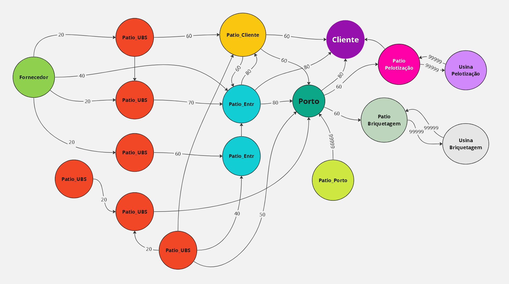
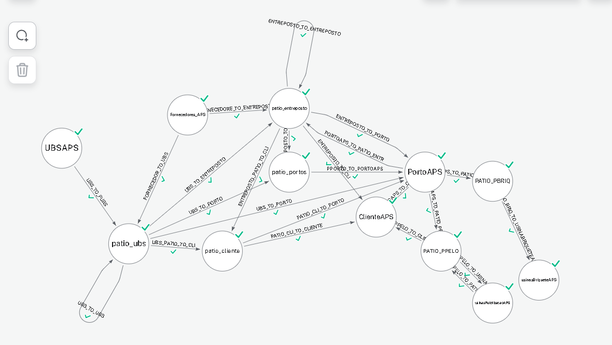
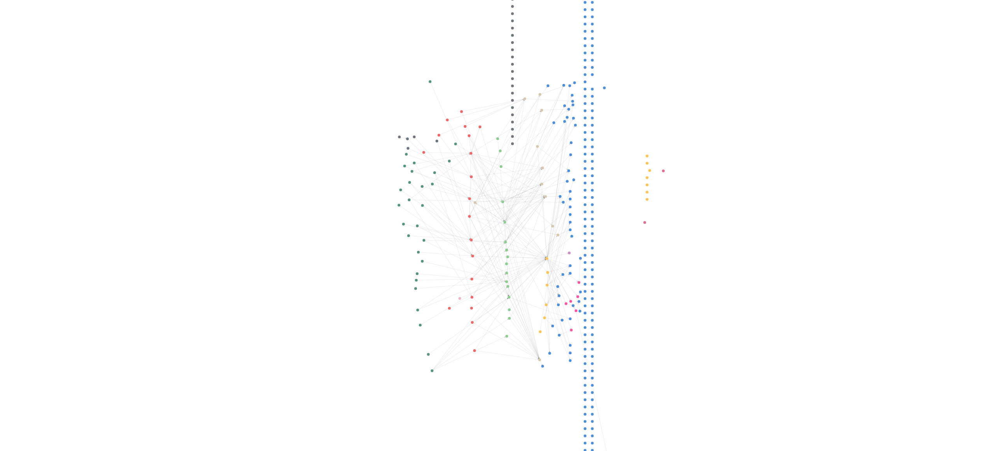
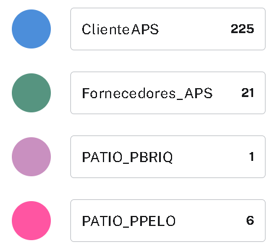
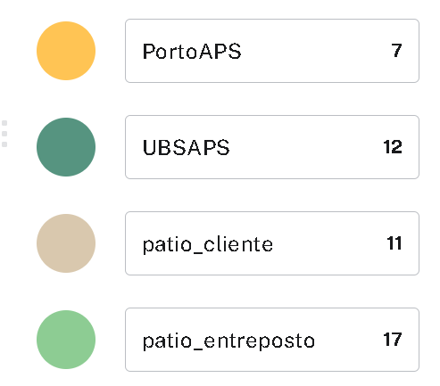
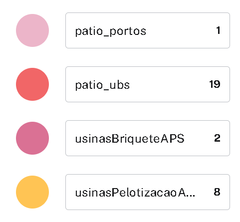
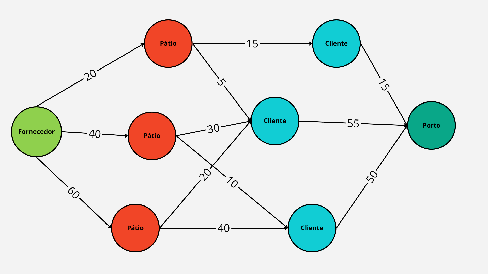
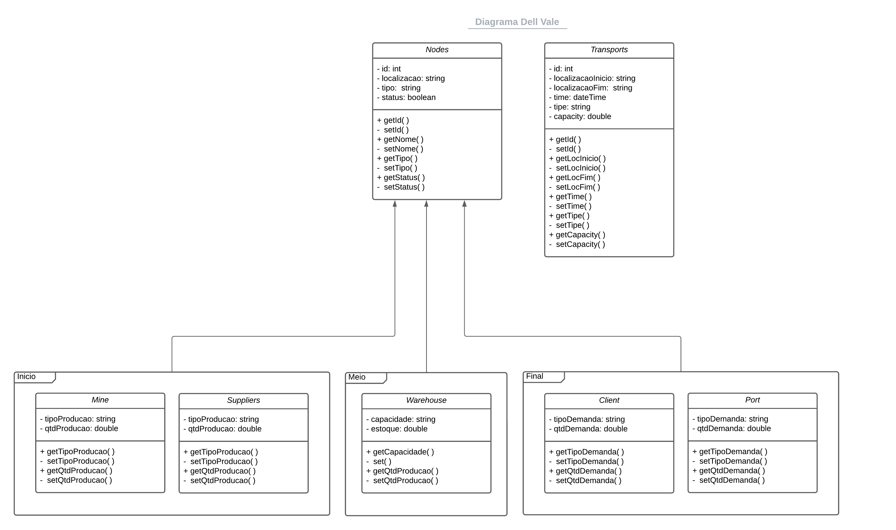

## Sumário

[1. Modelagem e Representação](#c1)

[1.1. Dados Disponíveis](#c2)

[1.2. Objetivo](#c3)

[1.3. Variáveis de decisão](#c4)

[1.4. Restrições do problema](#c5)

[1.5. Representação do Grafo no Neo4J](#c6)

[1.6. Indicação de Cenários Factíveis](#c7)

[1.7. Seleção de Algoritmos](#c8)

# 1.0 Entendimento do contexto do problema: Modelagem e Representação

&emsp;Nesta seção, será discutido sobre o contexto matemático do problema proposto pela Vale. De maneira geral, a Vale é uma mineiradora de extrema importância no mercado global e além de possuir uma complexa cadeia de produção e distribuição de minério ela tem a responsabilidade de atender a demanda,explorar o minerio e realizar uma distribuição eficiente de seus ativos pela cadeia logística. Sendo assim o ponto focal deste projeto é na otimização desta cadeia logística, ela gira em torno da quantidade maxima de minério que a compania consegue transportar por trecho. 

&emsp;Esta otimização tem como papel aumentar ao maximo o escoamento da produção, diminuindo custos com estocagem e melhorando a entrega(tempo e volume), a otimização será feita utilizando grafos, onde cada nó representará um ponto real da malha logistica deles e cada aresta será uma ligação entre nós, podendo ser uma ferrovia, via fluvial, esteira, etc. Cada aresta terá a sua limitção de transporte de acordo com o meio de transporte da aresta, além disso cada usina terá a sua capacidade de produção. 

&emsp;Para a modelagem serão utilizados dados fornecidos pela Vale sobre os sistemas Norte e Sudeste, com posse deles é possivel saber a quantidade de nós, os tipos deles, as conexões entre eles e informações operacionais como tempo de percurso, capacidade de cada tipo de transporte etc, na seção 1.1 abordaremos com maior enfoque os dados disponiveis.  Em o grafo modelado terá os seguinte estrutura de nós e arestas:

**Usinas de Beneficiamento**
- Representam as usinas onde o beneficiamento do minério;
- Cada usina de beneficiamento é um nó no grafo;

**Fornecedores**
- São mineradoras ou siderurgicas independentes que oferecem as suas produções para a Vale que efetua  a venda ao cliente final e entrega.
- Cada fornecedor é um nó no grafo;

**Patios**

- São os pontos onde ocorre o  transporte própriamente dito e existe uma conexão com os demais pontos;
- Existem varios tipos de patios, mas os mais importantes que trataremos aqui são: patios de usinas, patios de portos, patios de entrepostos, patios de clientes, patios de pelotização e patios de briquetagem, estes são os que levaremos em conta na otimização.
- Cada patio é um nó no grafo que esta conectado com os nós correspondentes aos seus tipos.

**Portos**
- São os pontos  de saida do minério para a exportação;
- No Brasil representa a ultima conexão na malha logístca;
- cada Porto é um nó do grafo, mas os principais e que serão abordados na otimização são os portos Brasileiros, principalmente o porto de Tubarão;

**Clientes**
- São os destinatarios da produção, podem ser tanto clientes nacionais,quanto internacionais.
- Cada cliente é um nó e os principais a serem abordados na otimização são os clientes nacionais.

**Usinas de Pelotização**
- São usinas que produzem produtos aglomerados do menerio de ferro chamados de pelotas.
- Cada usina de pelotização são nós no grafo;

**Usina de Briquetagem**
- São Usinas que produzem outro produto aglomerado do minerio de ferro, o briquete.
- Cada usina de briquetagem é um nó no grafo.

**Relações de trecho(Arestas)**
- Representam os modais de transporte (estradas, ferrovias, etc.) entre os diferentes pontos do sistema.
- Conectam todos os nós que possuirem uma conexão nos dados fornecidos pela Vale, em suma conectam toda a cadeia da usina até o porto.
- Cada aresta é direcionada e indica a direção do fluxo de minério.

&emsp;Vale ressaltar que para todos estes pontos, existe um tipo de patio correspondente que irá se conectar efetivamente com outros patioa até chegar ao porto ou cliente nacional, sendo assim alguns nós serão representados somente pelo patio de mesmo tipo.

## 1.1 Dados Disponíveis

&emsp;Para a construção do modelo e otimização, foram disponibilizados dois arquivos XML contendo dados dos sistemas logísticos da Vale. Mais especificamente, o primeiro refere-se ao sistema Norte, e o segundo, ao sistema Sudeste de transporte. Essas bases de dados estão divididas de maneira hierárquica, de forma que temos o cenário que engloba todos os dados do arquivo. Dentro dele, possuímos efetivamente os dados que utilizaremos. No total, temos 12 objetos, porém, excluindo seções vazias e irrelevantes, como ids e nomes, restam 7 seções. São elas: apoio, cadeia, demanda, fluxo, produto, propriedades e controleQualidadeSequenciaIntermediario.

&emsp;Focaremos apenas nas seções de Cadeia e Fluxo, pois ambas possuem informações que serão utilizadas para a modelagem do grafo. A seção de Cadeia contém informações dos pontos da cadeia produtiva da Vale, denotados pelo tipo de ponto seguido de APS. Além disso, possui dados de estocagem, históricos de transporte e custo. No entanto, muitas informações referentes a custos estão vazias. A seção de Fluxo contém informações de trechos de transporte que contêm os nós (ids) de origem e destino de cada trecho e informações das redes de transporte, como capacidade de transporte, modais e submodais.

&emsp;As demais seções possuem informações de cada produto, como tipo de minério, qualidade, além de informações sobre a demanda, a qualidade do minério e propriedades da otimização da própria Vale. Em suma, os dados mais importantes para a modelagem neste momento são os dados de Cadeia e Fluxo.

 
## 1.2 Objetivo

&emsp;O principal objetivo deste problema é otimizar a entrega de minérios por meio da malha logística da Vale. Este objetivo visa maximizar a entrega, aumentando a quantidade de minério que sai das usinas de beneficiamento e encontrando o maior fluxo possível para a malha existente. Além de maximizar a entrega, a solução ótima fornece ao time de planejamento da Vale uma referência de operação otimizada, oferecendo uma visão geral de quanto material pode passar por cada ponto em cada modalidade, garantindo que a entrega seja maximizada.

## 1.3 Variáveis de decisão

&emsp;Dentro deste problema, um ponto fundamental é a escolha da quantidade de material em toneladas que passará por cada aresta (conexão entre nós), possibilitando assim a maximização da entrega de materiais e aliviando as fontes e os pátios de carregamento. Sendo assim, tendo uma variável \( X_{ij} \) que representa o fluxo de material em toneladas entre o nó \( i \) e \( j \), temos:

$$ X_{ij}=\ fluxo(toneladas)\text{, para i,j} \in nós$$

&emsp;Dado que se trata de um problema de maximização, tem-se um cenário clássico de fluxo máximo. Abaixo está a função objetivo que orientará a busca pela solução ótima.

$$ max(F) = \sum _{ j\in N_f} x_{fj}  \text{ ou } \sum _{ i\in N_s  } x_{is}$$

&emsp;Onde \( N_f \) é o conjunto de nós conectados diretamente com a fonte e \( N_s \) é o conjunto de nós conectados com o sumidouro. Neste caso, pela definição do problema, teremos mais de uma fonte e mais de um sumidouro. Portanto, na modelagem, estamos considerando uma projeção de todos os finais a um único nó de destino e todas as fontes tendo um nó único de origem. Esses nós "únicos" são chamados de super sumidouro e super fonte, respectivamente. Na parte das restrições, serão tratadas dessas "projeções" e das principais restrições e limitações atreladas a este tipo de problema de fluxo máximo.

## 1.4 Restrições do problema 

&emsp;Dentre as principais restrições deste tipo de problema, temos as seguintes:

- **Conservação de fluxo (saída e chegada):** Dado um fluxo máximo, a quantidade que sai da fonte deve ser a mesma que chega no sumidouro. No entanto, ao considerarmos a possibilidade de estoque, esta restrição se transforma de igual para maior ou igual, pois a quantidade que chegaria pode ficar retida em algum nó de estoque.

$$\sum _{ j\in N_f} x_{fj}  \geq \sum _{ i\in N_s  } x_{is}$$

- **Conservação de fluxo (geral):** Dado um fluxo, a quantidade que sai de um nó deve ser a mesma que chega nele. 

$$\sum _{ i,j\in V} x_{ij}  = \sum _{ i,k\in V  } x_{jk}$$

- **Restrição de fluxo:** O fluxo não pode ser negativo, pois isso representaria uma inconsistência no modelo. Uma vez que o material somente pode sair de um nó a outro, somente serão admitidos valores maiores ou iguais a 0.

$$ X_{ij} \geq 0$$

- **Capacidade:** Para cada modal de transporte de um ponto a outro, ou a própria estocagem, temos uma quantidade limite de quanto material podemos levar e o quanto podemos deixar em um estoque do local. Esta capacidade é dada por $C_{ij}$, sendo ela a capacidade máxima de fluxo entre um nó i e um j. Sendo assim, se modelarmos o estoque como um nó, podemos determinar o quanto de fluxo máximo ele pode ter e da mesma forma, em um transporte normal entre nós, podemos alterar a capacidade de acordo com o modal adotado entre os pontos da malha.

$$ X_{ij} \leq C_{ij}$$

## 1.5 Representação do Grafo no Neo4J

&emsp;Nesta seção, será abordada a representação visual do grafo modelado. Devido ao tipo de visualização suportado pelo Neo4j, ela será apresentada em três níveis de abstração diferentes: um grafo simplificado contendo os pesos de cada aresta e os principais pontos ligados, um modelo do Neo4j que originará o grafo completo e o grafo completo da Vale.

&emsp;Vale ressaltar que o modelo do Neo4j permite a criação de relações e nós, podendo ser atrelados a eles arquivos CSV contendo os dados propriamente ditos. Isso resultará no grafo completo. O grafo simplificado foi uma maneira de mostrar a cadeia de transporte da Vale, juntamente com a capacidade de cada aresta. Isso se deve ao fato de que, quando essas relações são formadas no Neo4j, temos apenas o nome da relação visível e não a capacidade, que será informada apenas nas propriedades da aresta.

### 1.5.1 Grafo simplificado

Figura 01 - Grafo simplificado

Fonte: Material produzido pelo Grupo 3 (2024)

&emsp;Este grafo foi feito para mostrar com mais clareza todas as relações e pontos, além de dar uma ideia de como se darão as conexões do grafo. É possivel notar que existe uma relação entre usinas de beneficiamento, isto ocorre por conta da presença dela nos dados fornecidos, porém dependendo dos casos adotados será possivel decidir a adoção destas conexões ou não.

### 1.5.2 Modelo Neo4j

Figura 02 - Modelo de grafo neo4j

Fonte: Material produzido pelo Grupo 3 (2024)

&emsp;Nesta modelagem, temos os pontos/nós e arestas de maneira generalizada. A partir desta modelagem e dos dados enviados ao Neo4j, ele montará o grafo completo com todas as relações possíveis. O grafo resultante é visível na Figura 03. Nem todas as relações serão utilizadas para a otimização, pois estaremos adotando apenas trajetos da usina até o cliente ou ao Porto de Tubarão. Portanto, este modelo nos mostrará todas as relações possíveis, mas precisaremos ponderar sobre quais sentidos adotaremos para o fluxo, eliminando assim caminhos da otimização.

### 1.5.3 Grafo baseado nos dados no Neo4J

Figura 03 - Grafo completo no neo4j

Fonte: Material produzido pelo Grupo 3 (2024)

&emsp;O grafo modelado representa uma estrutura de transporte com base nos dados da Vale referentes a pontos e trechos de transporte. A seguir, consta uma legenda de cor identificando cada ponto com seu respectivo tipo, de acordo com sua cor:

Figura 04 - Legenda 1

Fonte: Material produzido pelo Grupo 3 (2024)

Figura 05 - Legenda 2

Fonte: Material produzido pelo Grupo 3 (2024)

Figura 06 - Legenda 3

Fonte: Material produzido pelo Grupo 3 (2024)

&emsp;Vale ressaltar que existem pontos sem nenhuma conexão devido aos dados fornecidos. Na modelagem, foi necessário atribuir uma origem e um destino para estabelecer uma relação entre nós. Essa relação foi extraída da tabela de trechosTransporte e trechosSubRedeTranspote. No entanto, nem todos os nós estão presentes nesta tabela, resultando nesta visualização com nós conectados e pontos isolados. É possível perceber que o tipo de nó pátio, independente de sua especificação (usina, porto, entreposto, etc.), está conectado entre si, ou com o nó correspondente (usina, porto, cliente, etc.).

## 1.6. Indicação de Cenários Factíveis

&emsp;Cenários factíveis referem-se a configurações específicas e realizáveis dentro de um contexto determinado, nos quais as variáveis e condições se alinham de maneira viável para análises ou otimizações. No contexto do projeto de fluxo máximo da Vale, os cenários factíveis são representações concretas de diferentes configurações da malha logística, que considera diferentes metas e restrições. Esses cenários são formulados para serem alcançáveis e fornecem bases realistas para a aplicação da modelagem em grafo e algoritmos de otimização. Cada cenário delineia objetivos específicos e métricas de sucesso que podem ser quantificadas, permitindo uma avaliação objetiva do desempenho do sistema.

&emsp;Então, o próximo passo é aplicar em grafo e o algoritmo de otimização de fluxo máximo, que serão considerados cenários factíveis e viáveis que representam diferentes aspectos e objetivos do sistema de transporte de minério.

**Cenário 1 - Maximização do Volume de Entrega:**

&emsp;O objetivo do primeiro cenário é maximizar a quantidade de minério entregue através da malha logística da Vale. Este cenário envolve uma rede logística abrangendo usinas de beneficiamento, pátios intermediários, clientes intermediários e o porto final. A principal prioridade é aumentar o volume total de minério transportado, garantindo que a produção seja escoada de forma eficiente para atender às demandas do mercado. A métrica de sucesso associada a este cenário é o aumento percentual no volume total de minério entregue através da malha logística e a diminuição de gargalo em nós do grafo.

Figura 02 - Representação Grafo 02

Fonte: Material produzido pelo Grupo 3 (2024)

&emsp;No exemplo acima, consegue-se identificar o fornecedor dessa malha logística, tendo capacidade de expedição de 120 lotes de minérios para diferentes pátios intermediários. Estes, por sua vez, tem capacidades diferentes para enviar para cada cliente que, por fim, deve mandar os lotes para o porto. Como o objetivo é expedir a maior quantidade possível de produto do fornecedor para o porto final, uma das alternativas para solucionar esse problema é a utilização de algoritmos como o de Ford-Fulkerson, que analisa cada caminho possível aumentando o fluxo máximo a cada caminho possível encontrado. Dessa forma, em vez de mandar no problema descrito somente 15 lotes, por exemplo, pelo caminho superior, o algoritmo encontraria o fluxo máximo de 120 lotes utilizando todas as capacidades máximas.

**Cenário 2 - Otimização da Eficiência Operacional:**

&emsp;O segundo cenário tem como objetivo melhorar a eficiência operacional e reduzir gargalos na malha logística. Este cenário enfatiza a identificação de pontos fracos na rede. Isso inclui a otimização das capacidades de armazenamento, a minimização de atrasos e a maximização da utilização dos recursos disponíveis. A métrica de sucesso associada a este cenário é a redução percentual no tempo médio de transporte entre as usinas de beneficiamento, pátios intermediários e o porto final.

Figura 03 - Representação Grafo 03

Fonte: Material produzido pelo Grupo 3 (2024)

## Maximização de fluxo: análise de algoritmos secundários

&emsp;Utilizando o mesmo grafo do exemplo anterior, mas considerando as relações entre os nós como tempo de deslocamento entre eles em horas, em vez de quantidade de lotes, observa-se que o fornecedor consegue expedir minério que chegue nos pátios intermediários em períodos de 20, 40 e 60 horas. Tendo como métrica o tempo médio de transporte, para solucionar esse problema é necessário a utilização de algorítmos que encontre esse menor tempo, como o de Floyd-Warshall. Dessa forma, no exemplo do grafo, o algorítmo retornaria que o fornecedor deveria priorizar mandar os lotes pelo caminho superior, visto que é o que precisa de menos tempo para levar o produto até o cliente.

##  1.7. Seleção de Algoritmos

&emsp;O problema em questão trata-se de maximização do fluxo, uma questão fundamental em teoria dos grafos e logística. O objetivo é determinar a quantidade máxima de ferro que pode ser transportada para os clientes locais da empresa e o Porto de Tubarão. Essa análise demanda uma investigação detalhada dos algoritmos de fluxo máximo disponíveis. Em linhas gerais, esses algoritmos se baseiam na determinação dos fluxos ao longo dos caminhos até que não seja mais possível aumentá-los. Para a resolução do problema da Vale, quatro algoritmos específicos foram selecionados para análise: Algoritmo Ford-Fulkerson, Método de Edmonds-Karp, Algoritmo de Dinic e Algoritmo de Goldberg-Tarjan. Cada um desses algoritmos possui características e complexidades próprias que serão avaliadas para determinar a solução mais adequada às necessidades logísticas da empresa.

### Algoritmo Ford-Fulkerson

&emsp; O algoritmo de Ford-Fulkerson é reconhecido como uma das soluções mais recorrentes em problemas de fluxo máximo em redes. Esse título advém do uso do conceito de redes residuais, uma representação adaptada da rede original de fluxo que permite a iteração de fluxo por outros caminhos. Essencialmente, o algoritmo funciona aumentando de forma iterativa o fluxo em uma rede residual até que não seja mais possível incrementá-lo. Essa manipulação das capacidades das arestas, torna o algoritmo de Ford-Fulkerson uma ferramenta muito boa para a otimização de fluxos em redes.

&emsp;Um ponto forte do método é sua implementação facilitada, graças à lógica simples que o algoritmo possui. Essa característica torna-o muito adaptável ao contexto atual, no qual há uma grande gama de fatores naturais e locais que podem influenciar no desenvolvimento da solução. A simplicidade do algoritmo não apenas simplifica o processo de implementação, mas também facilita a compreensão e a manipulação do mesmo em ambientes onde a complexidade das variáveis pode ser significativa.

&emsp;Como este método possui um funcionamento único, e isso garante a ele um conjunto de prós e contras

**Prós:**

- Utiliza uma forma de resolução incremental, o que significa que progride aos poucos, aumentando o fluxo máximo a cada caminho possível encontrado na rede.
- Muita facilidade para implementar e possui diferentes técnicas de busca possíveis, como DFS (Busca em Profundidade) ou BFS (Busca em Largura).
- Sua adaptabilidade permite lidar com uma variedade de redes e restrições, tornando-o uma escolha versátil para um problema como o apresentado neste documento.

**Contras:**

- Relativamente lento quando aplicado a redes grandes, devido ao seu funcionamento baseado em iterações e à possibilidade de encontrar caminhos ineficientes.
- O tempo de execução pode ser alto se as características da rede são complexas.
- Projetado principalmente para lidar com números inteiros, o que dificulta sua implementação em casos com outros conjuntos numéricos.
- Requer muitos ajustes se há na rede algum ciclo de aumento negativo, ou seja, caminhos que o peso da aresta se torna menor que zero.

### Método de Edmonds-Karp

&emsp; O Método de Edmonds-Karp é uma variação do algoritmo de Ford-Fulkerson que também tem objetivo de solucionar problemas de fluxo máximo. A ideia central deste método é garantir que, em cada passo, o algoritmo selecione o caminho mais curto possível, o que leva a uma convergência mais rápida para o fluxo máximo. 

&emsp; Uma característica fundamental deste método é sua capacidade de utilizar a busca em largura (BFS) para encontrar o caminho de aumento mais curto na rede residual em cada iteração. O BFS é um algoritmo de busca usado para explorar todos os vértices de um nível antes de avançar para os vértices do próximo nível. Além disso, a utilização da busca em largura simplifica a implementação do algoritmo e contribui para a redução significativa do tempo de execução quando comparada a outras técnicas de busca, como a busca em profundidade (DFS).

**Prós:**

- Utiliza a busca em largura, o que significa que o algoritmo irá buscar pelo caminho de aumento mais curto.
- Adequado para redes de médio e grande porte, o que se difere do algoritmo de Ford-Fulkerson.
- Robusto em relação a ciclos de aumento negativos, devido à escolha do caminho mais curto.

**Contras:**

- Apesar de mais eficiente que o algoritmo de Ford-Fulkerson, o Método de Edmonds-Karp ainda pode ser lento em redes muito grandes ou com características complexas.
- A necessidade de manter uma fila para a busca em largura pode aumentar o consumo de memória em comparação com outras implementações.
- Requer cuidados adicionais ao lidar com redes que possuem capacidades não inteiras ou não lineares.

### Algoritmo de Dinic

&emsp;O algoritmo de Dinic, desenvolvido por Yefim Dinitz, é uma sofisticação do conceito básico de Ford-Fulkerson, trazendo melhorias significativas na eficiência para a solução de problemas de fluxo máximo em redes. A principal inovação introduzida por Dinic é a utilização de uma estrutura chamada rede de níveis, que é construída a partir da rede original por meio de uma busca em largura, ou breadth first search (BFS). Esta rede de níveis é usada para encontrar aumentos de fluxo, eliminando caminhos que não contribuem para o aumento do fluxo máximo e reduzindo assim o espaço de busca.

Prós:

- Melhoria na Eficiência: Dinic aprimora a eficiência em relação ao Ford-Fulkerson ao reduzir o número de iterações necessárias para alcançar o fluxo máximo, especialmente em redes densas.
- Complexidade Temporal Previsível: Possui uma complexidade temporal melhor e mais previsível do que o algoritmo de Ford-Fulkerson, tornando-o mais adequado para redes de grande escala.
- Menos Sensível a Caminhos Ineficientes: Reduz a possibilidade de escolher caminhos ineficientes, graças à estrutura de rede de níveis.

Contras:

- Implementação Mais Complexa: A construção da rede de níveis e a gestão de fluxos nessa estrutura adicionam complexidade à implementação do algoritmo.
- Não Ideal para Todas as Redes: Apesar de ser eficiente para muitas redes, em certos tipos de grafos, como aqueles com capacidades de arestas muito heterogêneas, o desempenho pode não ser tão bom quanto outras abordagens.

### Algoritmo de Goldberg-Tarjan

&emsp;O algoritmo de Goldberg-Tarjan, também conhecido como algoritmo Push-Relabel, representa outra evolução na busca de soluções para o problema de fluxo máximo. Diferentemente dos algoritmos baseados em caminhos de aumento, como Ford-Fulkerson e Dinic, o Push-Relabel trabalha modificando os fluxos locais através de operações de "push" (empurrar) e "relabel" (reclassificar), sem a necessidade de encontrar caminhos de aumento completos a cada iteração.

Prós:

- Alto Desempenho em Redes Densas: Mostra-se extremamente eficaz em redes densas, onde outros algoritmos podem enfrentar dificuldades.
Flexibilidade e Adaptabilidade: Sua abordagem única o torna adaptável a uma ampla gama de problemas de fluxo, inclusive aqueles com restrições adicionais.
Eficiência Consistente: Oferece uma complexidade de tempo eficiente e consistente, sendo uma das soluções mais rápidas disponíveis para o problema de fluxo máximo.

Contras:

- Curva de Aprendizado e Implementação: O conceito de push-relabel pode ser menos intuitivo do que os métodos baseados em caminhos de aumento, exigindo uma compreensão mais aprofundada e uma implementação mais cuidadosa.
Ajuste Fino Necessário: Para alcançar a eficiência máxima, pode ser necessário ajustar o algoritmo com heurísticas específicas, o que aumenta a complexidade da implementação.

**Conclusão**

&emsp;A escolha entre o algoritmo de Dinic e o de Goldberg-Tarjan para resolver problemas de fluxo máximo em redes depende fortemente das características específicas do problema em questão e das preferências de implementação do desenvolvedor. O algoritmo de Dinic, com sua abordagem baseada na construção de uma rede de níveis para reduzir o espaço de busca, é particularmente eficaz em situações onde essa estrutura pode ser aproveitada para acelerar a busca por caminhos de aumento. Sua eficácia é notável especialmente em redes com estrutura específica ou em casos onde o número de fases é relativamente baixo.

Por outro lado, o algoritmo Push-Relabel de Goldberg-Tarjan, com sua abordagem mais localizada e adaptável, oferece excelente desempenho em uma ampla variedade de redes, incluindo aquelas com estruturas complexas ou densas. A capacidade do algoritmo de adaptar-se às peculiaridades da rede e sua abordagem eficiente em termos de operações locais tornam-no uma escolha poderosa para muitos cenários de aplicação.

Portanto, a decisão sobre qual algoritmo utilizar deve considerar fatores como a estrutura da rede, o tamanho do problema, as limitações de recursos computacionais e a familiaridade do desenvolvedor com as técnicas específicas de cada algoritmo. Em alguns casos, pode ser vantajoso realizar uma avaliação preliminar para determinar qual dos dois se adapta melhor às características do problema em questão. Em suma, enquanto o algoritmo de Dinic é ideal para cenários que se beneficiam de sua abordagem estruturada e focada, o algoritmo Push-Relabel destaca-se pela sua adaptabilidade e eficiência em uma gama mais ampla de situações, tornando a escolha entre eles uma questão de adequação ao problema específico e preferências de implementação.

## 1.8 Diagrama UML de Classes

&emsp;Os diagramas UML representam visualmente os aspectos qualificáveis de um sistema, incluindo relacionamentos, comportamento, estrutura e funcionalidade. Os elementos de diagrama visualizam classificadores em um sistema, mas não têm valor semântico próprio. Eles auxiliam desenvolvedores a entender, colaborar e criar aplicativos, o que permite a visualização do sistema completo e a divisão em componentes menores para o desenvolvimento.

&emsp;Dentre os seis tipos de diagramas estruturais na UML, os diagramas de classes são fundamentais, modelando a estrutura estática do sistema. Podem ser usados para representar o sistema inteiro ou seus componentes, mostrando objetos, relacionamentos entre eles e os serviços que oferecem.

&emsp;Os diagramas de classe desempenham papel crucial em várias etapas do design do sistema. Na análise, ajudam a compreender os requisitos do problema e identificar componentes. Durante o projeto orientado a objetos, as classes representadas nos diagramas iniciais se transformam em classes e objetos reais no código. Conforme o projeto avança, os diagramas de classe são refinados para mostrar partes específicas do sistema, interfaces com o usuário, implementações lógicas, entre outros aspectos. A seguir, foi construído um diagrama UML que fornece uma visão geral do sistema do problema apresentado pela Vale S.A. através de classes e seus respectivos elementos:

Figura 02 - Diagrama de Classes UML

Fonte: Material produzido pelo Grupo 3 (2024)

&emsp;Esse diagrama acima é composto por classes que representam as entidades e os estágios do processo logístico, este diagrama serve como um modelo para o desenvolvimento e a integração de componentes do sistema.

**Entidades:**

&emsp;A classe *Nodes* encapsula os pontos críticos da rede logística, tais como as localizações das minas, pontos de transferência e centros de distribuição. Atributos como id, localizacao, tipo, e status permitem a identificação e o estado operacional dos nós, enquanto os métodos get e set oferecem a flexibilidade necessária para atualizações dinâmicas em respsta a mudanças operacionais.

&emsp;A classe *Transports* é essencial para o monitoramento e gerenciamento dos veículos de transporte do sistema. Atributos detalhados permitem o rastreamento de cada transporte desde a origem até o destino (localizacaoInicio, localizacaoFim), incluindo o momento exato da viagem (time), tipologia do transporte (tipo), e a capacidade do transporte(capacidade). Métodos correspondentes são providenciados para manipulação eficiente dessas propriedades, o que é vital para otimizar a alocação de transporte e a eficiência da frota.

**Fases Logísticas**:

&emsp;*Usine* e *Suppliers*, localizadas na fase inicial, representam os pontos de produção. Eles monitoram o tipo e a quantidade de produto (tipoProducao, qtdProducao). A habilidade de ajustar esses valores dinamicamente assegura que a entrada do sistema esteja alinhada com as metas de produção e a demanda do mercado.

&emsp;*Warehouse*, posicionada na etapa intermediária, gerencia o armazenamento do minério. Capacidade (capacidade) e quantidade de produto (qtdProduto) são atributos chave que, junto aos métodos fornecidos, permitem o ajuste em tempo real do inventário, garantindo um balanço efetivo entre oferta e demanda.

&emsp;As classes *Client* e *Port* definem os consumidores finais da cadeia logística. Eles detalham as necessidades do mercado (tipoDemanda, qtdDemanda) e as capacidades de expedição, permitindo que o sistema se adapte a flutuações na demanda e assegure que o minério seja entregue eficientemente para os clientes e exportado através dos portos.

&emsp;Com a utilização do recurso UML para criar um diagrama de classes, pôde-se observar como foram subdivididas as classes e funcionalidades durante o sistema. Com isso, é possível perceber que ele é dividido em três parte principais, os nós de início, intermediários e finais. Esse _insight_ é importante porque, a partir deste ponto, o problema é decomposto em partes menores contendo funcionalidades mais específicas. Logo, este diagrama é fundamental para o desenvolvimento de um sistema robusto, que oferece visibilidade completa e controle sobre o processo logístico. Com a implementação desse modelo em Java, podemos esperar uma solução de software altamente eficaz que traduzirá os complexos requisitos logísticos da Vale em operações otimizadas e adaptativas. A estrutura de classes reflete a importância de uma abordagem modular e escalável, essencial para a evolução contínua do sistema em resposta às exigências de um ambiente operacional dinâmico.

