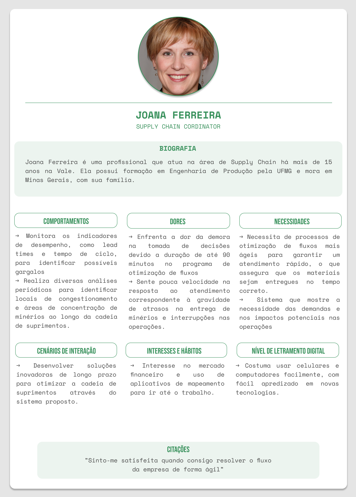

# Entendimento da experiência do usuário

## Sumário

[1. Personas](#c1)

[2. User Stories](#c2)

[3. Requisitos do Sistema](#c3)

## 1. Personas

&emsp;Personas são representações fictícias de perfis de usuários criadas a partir da observação do comportamento dos usuários, o que permite uma compreensão mais profunda das necessidades dos clientes, já que foi criada uma empatia com essas necessidades, comportamentos e expectativas. De acordo com Nielsen Norman Group, uma autoridade reconhecida em design de experiência do usuário, as personas são uma estratégia fundamental para orientar as estratégias de negócio e garantir que os produtos oferecidos atendam às expectativas específicas de diferentes segmentos de público. Quando se personificam as características e motivações dos usuários, as personas facilitam a criação de experiências mais relevantes e personalizadas, promovendo maior engajamento e satisfação do cliente. Tendo isso em vista, foram desenvolvidas X personas para representar esses usuários da solução proposta, que serão mostradas a seguir:

Figura 01 - Persona 01

Fonte: Material produzido pelo Grupo 3 (2024)

&emsp;Com isso, pode-se concluir que o desenvolvimento da persona foi essencial para a construção do cenário e limitações que a solução relaciona. Dentro do cenário projetado, a persona representa um foco muito importante para o projeto, principalmente ao deixar claro que as prioridades são em desenvolver uma solução rápida e que defina a quantidade de minério transportado. Alem disso, é importante destacar o potencial resolutivo cuja solução contém, já que trata-se de um escopo com uma ordem nacional e internacional.

## User Stories

&emsp;User stories são ferramentas utilizadas no desenvolvimento de um software para colocar o usuário e suas necessidades no cerne da solução, orientando o desenvolvimento de maneira que o fluxo de trabalho esteja alinhado com o cliente final. Elas consistem basicamente em frases curtas que, em conjunto, conseguem exprimir as dores e as necessidades dos usuários, apoiando na construção de features e decisões quanto a modelagem da solução. A presença delas é imprescindível quando se quer atender o usuário da melhor forma, pois, à medida que são construídas, uma visão mais completa acerca do destino e valor da solução se faz presente, além de deixar toda a equipe envolvida no projeto ciente da necessidade do usuário com certa clareza. Assim, confere um horizonte e fomenta um ambiente, em que todos conhecem o usuário, possibilitando um  brainstorming mais produtivo e rico. 

&emsp; Nesse sentido, as user stories seguem o padrão: "Eu como [algum usuário mapeado], quero [ação que este usuário precisa realizar/feature do software], para que [benefício que ele terá com esta tarefa ou objetivo dele com ela].". É de suma importancia que ela esteja clara e concisa, para que a feature, o usuário e o valor sejam perceptíveis a todos os membros da equipe.

&emsp;Abaixo é possível visualizar as user stories criadas focando no usuário final deste projeto. Elas representam as dores e anseios dos engenheiros da área de supply chain da Vale que estão alocados na área de planejamento da logística e transporte dos minérios.

Quadro 01 - User Stories

| **Número** | **Descrição**                        |
| ----- | ------------------------------------ | 
| US01  | Eu, como coordenadora de supply chain, quero planejar a melhor rota que permita a produção ser escoada de maneira rápida e efetiva, para que não ocorra nenhum atraso na cadeia de transporte. |
| US02  | Eu, como planejador de transportes, quero visualizar a rota e os históricos de cada ponto, para verificar a veracidade da solução encontrada pelo algoritmo. |
| US03  | Eu, como coordenadora de supply chain, quero avaliar múltiplos cenários de forma eficiente, para não perder meu dia de trabalho esperando o algoritmo terminar. |
| US04  | Eu, como coordenadora de supply chain, quero extrair os resultados e visualizações de maneira simples, para apresentá-los a outras áreas e aos meus superiores. |
| US05  | Eu, como coordenadora de supply chain, quero garantir que a produção atenda às demandas de maneira eficiente, com o mínimo estoque possível, para otimizar o fluxo de minérios pela cadeia logística. |
| US06  | Eu, como coordenadora de supply chain, quero ter informações sobre as capacidades de cada modal e a quantidade de minério transportada, para comparar com a realidade e efetuar alterações pontuais de capacidade. |

Fonte: Material produzido pelo Grupo 3 (2024)

## Requisitos do Sistema 

&emsp;Os requisitos do sistema são uma parte fundamental no desenvolvimento de software, pois descrevem as condições, características e funcionalidades que um sistema de software deve atender para satisfazer as necessidades do usuário e as especificações do projeto. Esses requisitos podem incluir requisitos funcionais, que descrevem as operações e funcionalidades que o sistema deve realizar, e requisitos não funcionais, que definem atributos do sistema, como desempenho, usabilidade, segurança e confiabilidade.

### Requisitos Funcionais

&emsp;Os requisitos funcionais são especificações detalhadas das operações e funcionalidades que um sistema de software deve executar. Eles descrevem as ações que o sistema deve ser capaz de realizar em resposta a diferentes entradas e condições. Esses requisitos definem o comportamento esperado do sistema, incluindo suas operações, entradas, saídas e interações com os usuários e outros sistemas. Os requisitos funcionais geralmente são expressos em termos de casos de uso, fluxos de trabalho ou cenários de usuário, e fornecem uma base para o desenvolvimento, teste e validação do software. A seguir serão apresentados os requisitos funcionais exemplificados para o projeto:

Quadro 02 - Requisitos Funcionais

| Número do Requisito | Nome do Requisito | Descrição | Prioridade |
|----------------------|-------------------|-----------|------------|
| RF01 | Receber Dados em Formato JSON | O frontend deve ser capaz de receber dados referentes à estrutura da cadeia de distribuição de minérios da Vale no formato JSON. | Alta |
| RF02 | Validação de Dados de Entrada | O sistema deve validar os dados recebidos em JSON para garantir que estão corretos e completos antes de processá-los. | Alta |
| RF03 | Conversão para Grafo Visual | Os dados recebidos devem ser convertidos em um grafo visual que represente a estrutura da cadeia de distribuição, com nós representando locais de origem, destinos e intermediários, e arestas representando os fluxos de minérios entre esses nós. | Alta |
| RF04 | Exibição de Fluxo Máximo | O grafo visual deve ser capaz de exibir o fluxo máximo de minérios possível entre os nós, conforme calculado pelo modelo de fluxo máximo implementado. | Alta |
| RF05 | Interatividade | Os usuários devem poder interagir com o grafo, por exemplo, clicando em nós para visualizar detalhes sobre o volume de minério que entra e sai de cada nó, bem como o fluxo máximo possível. | Média |
| RF06 | Atualização Dinâmica | O grafo visual deve ser atualizado dinamicamente sempre que houver uma alteração nos dados de entrada ou nos parâmetros do modelo de fluxo máximo. | Alta |
| RF07 | Exportação de Resultados | Deve ser possível exportar os resultados do fluxo máximo, bem como a estrutura do grafo visual em formatos comuns, como JSON, CSV ou PDF. | Média |
| RF08 | Personalização da Visualização | Os usuários devem ter a capacidade de personalizar a visualização do grafo, incluindo opções para ajustar o layout, cores, estilos de nós e arestas, para melhor atender às suas necessidades de análise. | Baixa |
| RF09 | Suporte a Múltiplos Grafos | O sistema deve permitir a visualização e manipulação de múltiplos grafos de distribuição de minério, possibilitando aos usuários alternar entre diferentes cenários ou regiões de operação da Vale. | Baixa |
| RF10 | Integração com Backend | O frontend deve ser capaz de se integrar facilmente com o backend responsável pelo cálculo do fluxo máximo, enviando dados de entrada e recebendo resultados de forma eficiente e segura. | Alta |

Fonte: Material produzido pelo Grupo 3 (2024)

### Requisitos Não Funcionais

&emsp;Os requisitos não funcionais referem-se aos atributos de qualidade que um sistema de software deve possuir, além das suas funcionalidades principais. Eles descrevem as características do sistema que não estão relacionadas diretamente com as operações específicas que o sistema realiza, mas que são essenciais para garantir seu desempenho, segurança, usabilidade e outros aspectos importantes. Conforme definido por Bass, Clements e Kazman (2003), os requisitos não funcionais podem incluir aspectos como desempenho, confiabilidade, escalabilidade, usabilidade, segurança e interoperabilidade. Enquanto os requisitos funcionais descrevem o que o sistema faz, os requisitos não funcionais descrevem como o sistema realiza suas funções, bem como suas características globais. A seguir, será apresentado o quadro de requisitos não funcionais do sistema:

Quadro 03 - Requisitos Não Funcionais

| Número do Requisito | Nome do Requisito | Descrição | Prioridade |
|----------------------|-------------------|-----------|------------|
| RNF01 | Desempenho | O sistema deve ser capaz de lidar eficientemente com grandes conjuntos de dados, garantindo tempos de resposta rápidos mesmo durante o cálculo do fluxo máximo e a atualização do grafo visual. | Alta |
| RNF02 | Usabilidade | A interface do usuário deve ser intuitiva e fácil de usar, mesmo para usuários sem experiência técnica em modelagem de fluxo máximo ou visualização de grafos. | Alta |
| RNF03 | Escalabilidade | O sistema deve ser projetado para ser facilmente escalável, possibilitando a adição de novos nós e arestas à medida que a estrutura da cadeia de distribuição da Vale evolui. | Alta |
| RNF04 | Manutenibilidade | O código-fonte do frontend deve seguir as melhores práticas de desenvolvimento de software, facilitando a manutenção e a implementação de novos recursos no futuro. | Média |

Fonte: Material produzido pelo Grupo 3 (2024)

