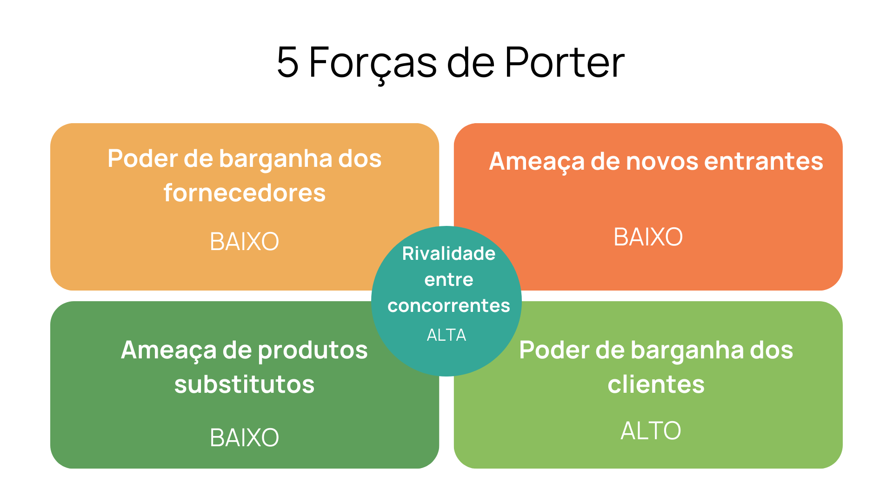
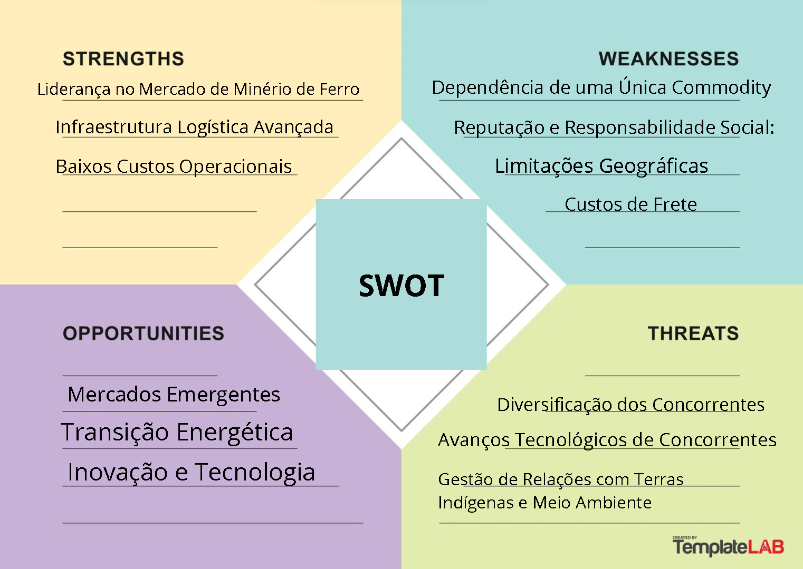
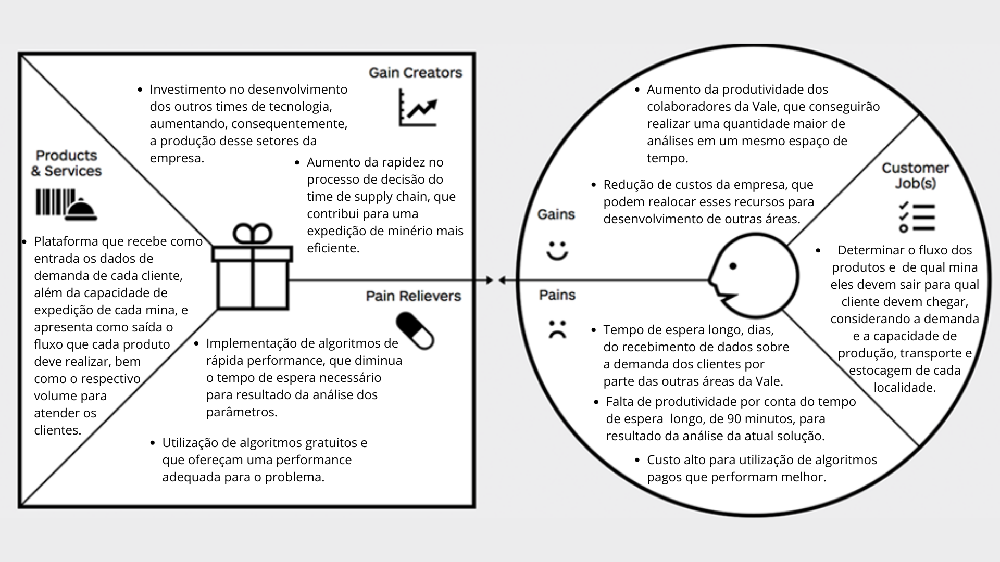
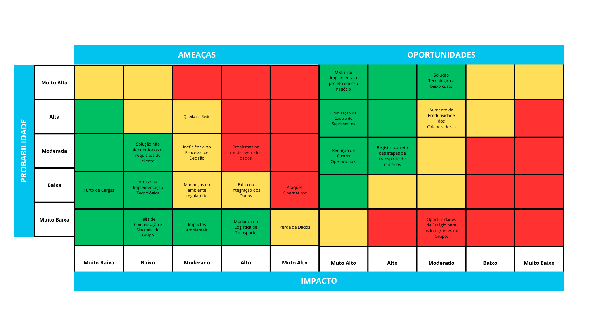

# Entendimento de negócio

## Sumário

[1. Contexto da Indústria](#c1)

[1.2. 5 Forças De Porter](#c1_2)

[2. Análise SWOT](#c2)

[3. Descrição da Solução a ser Desenvolvida](#c3)

[4. Value Proposition Canvas](#c4)

[5. Matriz de Riscos](#c5)

[Referências](#cref)

##  1. Contexto da indústria do parceiro

&emsp;A indústria de mineração representa uma parte vital da economia global, desempenhando um papel essencial na extração de recursos minerais que sustentam uma variedade de setores, desde a construção civil até a produção de tecnologia avançada. Em um mundo onde a demanda por recursos naturais continua a crescer, a mineração emerge como um setor-chave para fornecer os materiais necessários para impulsionar o desenvolvimento econômico e atender às necessidades da sociedade moderna. O mercado de mineração global é impulsionado principalmente pela demanda por commodities como minério de ferro, carvão, cobre, ouro, alumínio, níquel e zinco. Esses materiais são utilizados em diversas indústrias, incluindo construção, manufatura, eletrônicos, energia e transporte. Atualmente, o mercado global no setor de mineração está valendo cerca de 320 bilhões de dólares e tem potencial para crescer para 1 trilhão de dólares em 2030.

&emsp;Dentro do mercado de mineração, as principais empresas são: a BHP Billiton, com um valor de mercado de 232,91 bilhões de dólares australianos (AUD), a Rio Tinto com um valor de mercado de 176,39 bilhões de AUD, a Glencore com um valor de mercado de 47,49 bilhões de libras esterlinas (GBP) e a Vale S.A com um valor de mercado de 298,62 bilhões de reais (BRL).

&emsp;De acordo com o relatório financeiro do terceiro trimestre de 2023 da Vale S.A., a empresa apresenta avanços significativos em suas prioridades estratégicas, tais como o aumento da produção de minério de ferro, a transição para operações subterrâneas na mina Voisey's Bay e o sucesso do ramp-up de Salobo III no segmento de cobre. A receita líquida de vendas aumentou para US$ 10.623 milhões, com um EBIT ajustado de US$ 3.397 milhões e um lucro líquido de US$ 2.836 milhões. Além disso, a Vale enfatiza investimentos em sustentabilidade e a redução do nível de emergência da barragem B3/B4 para 1, seguindo o novo framework de gestão de barragens estabelecido em 2019.

&emsp;Este framework estabelecido pela Vale faz parte de um esforço abrangente para melhorar a segurança e a sustentabilidade de suas operações de mineração. Este framework envolve várias iniciativas e práticas, destacando-se pela sua abordagem integrada e pelo foco na mitigação de riscos e impactos ambientais. O framework tem como aspectos a descaracterização de barragens que envolve a remoção ou tratamento do material contido nas barragens para eliminar sua função como estruturas de retenção de rejeitos. Um exemplo é a barragem B3/B4, onde aproximadamente 85% do conteúdo do reservatório foi removido, melhorando significativamente a estabilidade da estrutura e permitindo a redução do seu nível de emergência para 1, conforme previsto pela legislação , gestão  de recursos hidricos buscando reduzir o consumo de água doce por tonelada de produção. Essa iniciativa reflete o compromisso da Vale com a sustentabilidade ambiental e a gestão responsável dos recursos naturais , promoção da mineração circular e buscando oportunidades de descarbonização em colaboração com parceiros estratégicos, como a Petrobras. Isso inclui o desenvolvimento de combustíveis sustentáveis e tecnologias de captura e armazenamento de CO2, visando reduzir a pegada de carbono de suas operações.

&emsp;O mercado global de mineração está em constante evolução, impulsionado por uma combinação de avanços tecnológicos, mudanças nas demandas do consumidor e pressões ambientais. Sendo um dos mercados base para nossa economia que fornecem a materia prima para muitos outros setores , há várias tendências fundamentais estão moldando o cenário da indústria de mineração em todo o mundo. Atualmente as empresas de mineração buscam investir em novas tecnologias omo aprendizado de maquina, biotecnologia  que possam beneficiar na diminuição de custos ,inegridade da empresa  ,aumento da produção, redução de danos , tanto para o meio ambiente quanto para os trabalhadores como por exemplo o  desenvolvimento de ferramentas para facilitar a mineração através de sistemas de classificação baseados em sensores feitos pela Tomra Sorting Solutions e tambem o uso de inteligencia artificial para pelotização do minerio de ferro. 

###  5 Forças de Porter

&emsp;Uma das líderes globais do setor de mineração, a Vale S.A se destaca por ser a maior produtora de ferro e pelotas do Brasil, a companhia tem seu negócio principal na extração de minerais metálicos e não-metálicos, e na logística necessária para transportar estes materiais brutos clientes nacionais e internacionais. A empresa opera grandes infraestruturas de logística no Brasil, incluindo ferrovias, portos e navios, que são vitais para a movimentação de suas cargas.

&emsp;A fim de se obter um mapeamento detalhado da empresa e entender um pouco de como a empresa se mantém como potência global, é feito o uso das 5 Forças de Porter, uma ferramenta estratégica de negócios que permite o esclarecimento da competitividade e poder da empresa no mercado. As 5 forças são divididas em: 

* **Rivalidade entre concorrentes**: Esta força é responsável pela captura do nível de competição entre as empresas que já estão estabelecidas no mercado. Essa rivalidade é influenciada por vários fatores, incluindo a taxa de crescimento do mercado, a complexidade e o custo das mudanças tecnológicas e a capacidade das empresas de diferenciar seus produtos ou serviços.

* **Ameaça de Novos Entrantes**: Avalia a dificuldade da entrada de novas empresas que podem começar a competir no setor. Barreiras de entrada, como altos custos iniciais, requisitos regulatórios e lealdade à marca estabelecida, podem proteger as empresas existentes de novos concorrentes.

* **Poder de Barganha dos Fornecedores**: Analisa a capacidade dos fornecedores de negociar perante a empresa. Fornecedores fortes podem influenciar as empresas do setor, controlando preços ou qualidade dos insumos, os quais são considerados mais poderosos se houver poucos substitutos para seus produtos ou serviços, ou se fornecerem um componente vital para o negócio.

* **O Poder de Barganha dos Clientes**: Esta força avalia o impacto que os clientes têm no setor e seus respectivos poderes de negociação. Os compradores têm mais poder quando fazem grandes pedidos ou quando o produto que estão comprando é padronizado dentro do setor, desse modo, compradores poderosos podem demandar preços mais baixos ou serviços de maior qualidade, o que pode reduzir a rentabilidade.

* **Ameaça de Produtos Substitutos**: Produtos substitutos são aqueles que oferecem uma alternativa viável capaz de substituir os produtos da empresa a ser analisada, assim podendo limitar os preços e os lucros das empresas dentro de um setor. 

&emsp;Em conjunto, essas 5 forças se tornam essenciais para uma análise completa de uma empresa, pois definem o cenário estratégico que as empresas utilizam para compreender seu ambiente operacional e encontrar maneiras de melhorar sua posição competitiva no mercado. Abaixo, na figura, ilustra-se os pontos principais levantados durante a análise realizada sobre a Vale e suas características de mercado.

Figura 1- Análise das 5 Forças de Porter

Fonte: Material produzido pelo Grupo 3 (2024)

Visto isso, foi feita a seguinte análise a partir das 5 Forças de Porter da Vale:

* **Rivalidade entre os concorrentes** : 

&emsp;A Vale está posicionada como uma das principais empresas no cenário global da indústria de mineração, especialmente pela sua produção de minério de ferro. A rivalidade entre os concorrentes nesta indústria é intensa, dada a presença de outros gigantes internacionais como BHP, Rio Tinto e Fortescue Metals Group, e concorrentes nacionais de relevância menor como a Companhia Siderúrgica Nacional (CSN). Estas empresas competem em várias frentes, incluindo capacidade produtiva, inovação tecnológica, eficiência operacional, e práticas sustentáveis, o que foi comprovado com os investimentos substanciais feitos pela Rio Tinto e BHP a fim de automatizar seus processos logísticos, reduzindo assim seus custos e aumentando a segurança.

&emsp;Ademais, a BHP e a Rio Tinto são empresas australianas, são favorecidas por uma menor distância do principal cliente de minério do mundo, a China, o que impacta diretamente o frete dos produtos. Visto isso, essas empresas a fim de se fortalecerem no mercado, fizeram novas aquisições de minas na África, as quais possuem um minério de pureza relevante, semelhante ao de Carajás, impactando negativamente a Vale. Em resposta a isso, para manter a forte competitividade, a Vale está trabalhando constantemente na criação de mega hubs de minério na Europa.

&emsp;Já se tratando de outras valências, a sustentabilidade tornou-se um fator competitivo essencial. Após o desastre de Brumadinho em 2019, a Vale intensificou seus esforços para melhorar suas práticas ambientais, sociais e de governança (ESG), alinhando-se a uma tendência observada em todo o setor e se equiparando aos seus concorrentes.

&emsp;Porém, em um mercado de minérios, um grande fator é a capacidade produtiva, e nesse segmento a Vale está se mantendo firme em relação aos seus concorrentes. A empresa brasileira totalizou 321 milhões de toneladas de ferro produzidas, enquanto a Rio Tinto exportou 331,8 milhões de toneladas de minério de ferro e a BHP produziu 257,0 milhões de toneladas de ferro. Logo, a rivalidade entre os concorrentes pode ser classificada como alta, visto que é caracterizada por uma competição acirrada em múltiplas dimensões: capacidade produtiva, inovação, sustentabilidade e estratégia de mercado.

* **Ameaça de Novos Entrantes**:

&emsp;A capacidade de novos entrantes no setor de mineração, especialmente para uma empresa do calibre da Vale, é significativamente influenciada por diversos fatores estruturais e estratégicos que moldam a indústria. Devido ao setor de mineração demandar um alto investimento inicial em logística, tecnologia e infraestrutura, a entrada de novas empresas é dificultada.

&emsp;O investimento inicial necessário para explorar uma mina, desenvolver a infraestrutura necessária e iniciar a produção é extremamente alto. Visto isso, a Vale possui uma  capacidade financeira robusta, demonstrada por um fluxo de caixa operacional que alcançou R$58,20 bilhões em 2022, o que a torna capaz de sustentar e expandir suas operações em comparação com potenciais novos entrantes. Ademais, novas empresas precisam estar de acordo com normas e leis trabalhistas e ambientais,  que podem ser difíceis de obter sem uma demonstração clara de práticas de mineração responsáveis e sustentáveis.

&emsp;Em conjunto ao que foi citado, manter relações positivas com governos, comunidades locais e outros stakeholders é um desafio fundamental para o sucesso a longo prazo das operações de mineração, as quais já têm que superar as dificuldades dos processos judiciais e  logísticos de transporte e produção. 

&emsp;Portanto, enquanto a indústria de mineração oferece oportunidades significativas, a combinação de altas barreiras de entrada, exigências regulatórias, necessidades de capital intensivo e a necessidade de tecnologia avançada colocam a Vale em uma posição de vantagem considerável em relação aos potenciais novos entrantes no mercado.

* **Poder de Barganha dos Fornecedores**: 

&emsp;A Vale enfrenta a alta dependência de equipamentos pesados, tecnologia avançada para exploração e processamento de minerais, e a necessidade contínua de insumos e serviços logísticos, o que implica em negociações com fornecedores de alta relevância no mercado. Visto isso, a Vale faz uso de uma estratégia de diversificação de fornecedores, a fim de não se tornar dependente de algum bem ou empresa, isso foi evidenciado pela transição de fornecedores tradicionais como Caterpillar e Komatsu para alternativas como Scania, Berco, Amsted Maxion, e Soldering.

&emsp;A capacidade de fechar contratos que resultam em economias significativas, como visto nos casos da Berco e da Amsted Maxion, onde houve reduções de custos de 64% e 70%, respectivamente, demonstra a forte posição de negociação. Ademais, a Vale também cumpre um papel de negociação com fornecedores locais, o que aumenta consequentemente seu monopólio no mercado nacional e fomenta a economia local.

&emsp;Conclusivamente, a abordagem da Vale na gestão de seus fornecedores demonstra uma estratégia que minimiza o poder de barganha dos fornecedores. Isso é alcançado através da diversificação de fornecedores, alto poder de negociação, adaptabilidade às condições de mercado, e um compromisso com o fortalecimento da cadeia de suprimentos nacional, assegurando assim a competitividade da empresa no setor.                            

* **Poder de Barganha dos Clientes**:

&emsp;Por se tratar de uma gigante global, a Vale possui uma alta gama de clientes, dentre eles encontramos indústrias siderúrgicas consumindo ferro para a produção de aço, empresas de fertilizantes na compra de potássio, fabricantes de níquel e cobalto e empresas de infraestrutura no consumo de ferro, cobre e manganês, clientes estes que se situam por todo o globo, sendo China, México e Estados Unidos alguns deles. Logo, é necessário entender que quando se trata de um mercado de *commodities*, a lei da oferta e demanda é o que rege a sustentabilidade das empresas e respectivamente  suas negociações.

&emsp;A recente parceria com a Tesla para o fornecimento de níquel, crucial para a fabricação de baterias de veículos elétricos, ilustra uma adaptação estratégica da empresa e às demandas de um cliente com poder de barganha considerável. Este acordo não só reflete o compromisso compartilhado com a sustentabilidade, mas a também posiciona como um fornecedor chave de níquel de baixa emissão de carbono, uma vantagem competitiva dada a crescente demanda por práticas de produção sustentáveis​​.

&emsp;Além disso, sua expansão no mercado chinês, buscando clientes menores em regiões interiores, demonstra uma resposta estratégica ao poder de barganha dos clientes em um mercado altamente competitivo. A empresa está fechando acordos com empresas locais para melhorar sua distribuição, mostrando a importância de adaptar a cadeia de suprimentos e as opções de pagamento (como transações em yuans) para atender às preferências dos clientes​​.

&emsp;As parcerias com siderúrgicas como Hyundai e Posco para o uso de produtos à base de biomassa e briquete verde nos altos-fornos exemplificam ainda mais o alinhamento de suas operações com as exigências ambientais e de sustentabilidade de seus clientes.

&emsp;No contexto chinês, a estratégia da Vale de se aproximar de clientes menores e diversificar sua base de clientes reflete uma tentativa de mitigar o poder de barganha dos grandes compradores. Investimentos significativos em logística e infraestrutura, como o projeto de expansão do Porto de Shulanghu, visam reduzir custos e melhorar a eficiência, tornando a Vale mais atraente para uma gama mais ampla de clientes.

&emsp;Portanto fica evidente a grandeza das negociações e parcerias da Vale no mercado global, adaptando-se às demandas por materiais sustentáveis, melhorando a eficiência logística e diversificando sua base de clientes. Ela não está só fortalecendo sua posição competitiva global mas também atendendo às expectativas crescentes de clientes conscientes em termos ambientais e sociais. Desse modo, o poder de barganha de seus clientes pode ser caracterizado como alto.

* **Ameaça de Produtos Substitutos**: 

&emsp;O minério de ferro se mantém como matéria-prima essencial na indústria global, especialmente na fabricação de aço. Sua versatilidade e durabilidade, o tornam insubstituível na cadeia produtiva moderna. A Vale, oferece um minério de ferro de alto teor, especialmente de suas minas em Carajás, que é considerado um dos melhores em qualidade no planeta, tornando seus produtos diferenciados e menos suscetíveis à substituição. 

&emsp;Além disso, a inovação constante da empresa em seus processos e produtos, como o desenvolvimento do briquete de minério de ferro, destaca-se como um fator chave para minimizar essa ameaça. O briquete, por exemplo, é uma solução pioneira que oferece uma alternativa mais sustentável na produção de aço, reduzindo as emissões de gases do efeito estufa em até 10% em comparação com métodos tradicionais de sinterização. ela também transforma rejeitos da mineração em produtos para a construção civil, promovendo a economia circular e a sustentabilidade. Esta abordagem inovadora não apenas contribui para um menor impacto ambiental mas também cria produtos de valor agregado, dificultando sua substituição.

&emsp;Ademais, materiais como madeira, bambu e plástico oferecem alternativas sustentáveis, eles também apresentam desafios e limitações que destacam a dificuldade de substituir o minério de ferro. O bambu, apesar de sua resistência à tração superior à do aço, é suscetível a ataques de insetos e pode degradar na presença de água, limitando sua durabilidade em certas aplicações​​. A supermadeira, embora mais resistente que o aço e algumas ligas de titânio, requer processos especializados para atingir tal resistência, o que pode aumentar os custos e limitar sua aplicabilidade em larga escala​​. O plástico, apesar de versátil e durável, enfrenta questionamentos sobre seu impacto ambiental, especialmente em relação à poluição e ao desafio da reciclagem eficaz​​.  Produtos e formatos de ferro, tais como ferroligas, aço reciclado ou ferro produzido por métodos de redução direta, são alternativas que diferentes indústrias podem considerar. Porém, esses substitutos muitas vezes não alcançam a mesma pureza ou eficiência. Esses riscos e limitações contrastam com o ferro e inovações, como o briquete, o qual reduz significativamente as emissões de gases do efeito estufa, ao mesmo tempo em que transformam rejeitos em produtos úteis. Portanto, apesar das alternativas apresentarem potenciais benefícios sustentáveis, o principal produto da empresa permanece fundamental na indústria moderna.

**Conclusão**:

&emsp;Concluímos que a análise das 5 Forças de Porter aplicada à Vale destaca sua forte posição competitiva na indústria global de mineração, marcada por intensa rivalidade entre os gigantes do setor e altas barreiras de entrada que limitam novos concorrentes. Além disso, a empresa emprega estratégias eficazes de gestão de fornecedores e adaptação às demandas dos clientes, inclusive parcerias estratégicas e inovações para enfrentar a ameaça de produtos substitutos. Através de investimentos em sustentabilidade e eficiência operacional, ela não só mantém sua liderança na produção de ferro, mas também se alinha às tendências de consumo consciente e responsável para a natureza ambiental, garantindo sua continuidade como uma potência global no setor.

##  2. Análise SWOT

A Matriz SWOT, que representa Forças (Strengths), Fraquezas (Weaknesses), Oportunidades (Opportunities) e Ameaças (Threats), é uma ferramenta de análise estratégica fundamental para examinar tanto os fatores internos quanto externos que podem influenciar a capacidade de uma organização em alcançar seus objetivos. As forças e fraquezas abordam aspectos internos da organização, enquanto oportunidades e ameaças tratam de fatores externos ao seu ambiente.

Ao representar esses quatro elementos em uma matriz de duas dimensões, as organizações podem visualizar de forma clara as áreas em que são fortes e fracas, além de identificar as oportunidades que podem aproveitar e as ameaças que precisam enfrentar.

Figura 2 - Matriz SWOT

Fonte: Material produzido pelo Grupo 3 (2024)

### Forças

* &emsp;**Liderança no Mercado de Minério de Ferro:** A Vale é reconhecida como o maior produtor mundial de minério de ferro, destacando-se pela qualidade do seu produto. O minério de ferro da Vale é conhecido por seu alto teor de ferro e baixos níveis de impurezas, tornando-o particularmente desejável para a produção de aço mais eficiente e ambientalmente sustentável. Isso coloca a Vale em uma posição de destaque no mercado global, especialmente em um contexto onde há uma crescente demanda por práticas de produção mais limpas e sustentáveis.

* &emsp;**Infraestrutura Logística Avançada:** A Vale investiu significativamente em uma infraestrutura logística robusta, que inclui ferrovias, portos e uma frota de navios dedicados, facilitando o transporte eficiente de seus produtos do Brasil para mercados chave ao redor do mundo. Esta infraestrutura não apenas reduz os custos de transporte, mas também assegura a preservação da qualidade do minério durante o transporte, reforçando a posição competitiva da Vale.

* &emsp;**Baixos Custos Operacionais:** A eficiência operacional da Vale, impulsionada pela localização estratégica de suas minas e pela escala de suas operações, resulta em custos de produção relativamente baixos em comparação com muitos de seus concorrentes. Isso permite que a Vale mantenha margens de lucro saudáveis e seja competitiva em períodos de baixa nos preços das commodities.

### Fraquezas

* &emsp;**Dependência de uma Única Commodity:** A Vale tem uma forte dependência em relação ao minério de ferro, que constitui a maior parte de sua receita. Essa concentração aumenta a vulnerabilidade da empresa às flutuações de preços e às dinâmicas do mercado global de minério de ferro.

* &emsp;**Limitações Geográficas:** A concentração das operações da Vale no Brasil expõe a empresa a riscos específicos, incluindo desafios regulatórios, políticos e de infraestrutura, que podem impactar a eficiência e os custos operacionais.

* &emsp;**Reputação e Responsabilidade Social:** Incidentes passados, como os desastres de barragem em Mariana e Brumadinho, afetaram negativamente a reputação da Vale, complicando suas relações com comunidades, governos e investidores, e impondo desafios adicionais em termos de responsabilidade social e ambiental.

* &emsp;**Custos de Frete:** A distância das principais minas da Vale em relação aos seus maiores mercados, especialmente a Ásia, resulta em custos de frete significativos, que podem impactar a competitividade da empresa em relação a concorrentes mais próximos desses mercados.

### Oportunidades

* &emsp;**Mercados Emergentes:** O desenvolvimento econômico de países emergentes apresenta uma oportunidade significativa para a Vale expandir sua presença e vendas, dada a crescente demanda por minério de ferro e outros metais para construção e infraestrutura.

* &emsp;**Transição Energética:** A crescente demanda por metais utilizados em tecnologias limpas e renováveis, como o cobre e o níquel, representa uma oportunidade para a Vale diversificar e expandir suas operações nestes segmentos.

* &emsp;**Inovação e Tecnologia:** Investir em tecnologias avançadas e práticas de mineração sustentável pode melhorar ainda mais a eficiência da Vale, reduzir custos e atender às crescentes demandas por mineração responsável.

### Ameaças

* &emsp;**Diversificação dos Concorrentes:** A capacidade de empresas concorrentes, como a BHP e a Rio Tinto, de diversificar produtos e geografias oferece a elas uma vantagem em termos de mitigação de riscos e acesso a novos mercados.

* &emsp;**Avanços Tecnológicos de Concorrentes:** Investimentos em tecnologias avançadas por concorrentes, como veículos autônomos e operações remotas, podem oferecer a eles vantagens em termos de custo e eficiência operacional, desafiando a competitividade da Vale.

* &emsp;**Gestão de Relações com Terras Indígenas e Meio Ambiente:** Melhores práticas de gestão ambiental e relações comunitárias por parte dos concorrentes podem melhorar o acesso deles a novos projetos e licenciamentos, representando uma ameaça à expansão e operação da Vale.

* &emsp;Essa análise detalhada SWOT fornece uma visão abrangente dos pontos fortes e fracos internos da Vale, bem como das oportunidades e ameaças externas que podem impactar sua Matriz Swot.

##  3. Descrição da Solução a ser Desenvolvida

### O Problema

&emsp;A Vale está em busca de otimizar o transporte de minérios em seu sistema de distribuição, composto por diversos centros de distribuição, pequenos consumidores locais, estoques intermediários ao longo do percurso e o Porto de Tubarão como destino final. Atualmente, a alocação de recursos e a determinação das rotas ideais consomem um tempo considerável devido à ausência de uma solução automatizada. Especificamente, cada iteração em busca de uma solução ótima demanda aproximadamente 90 minutos. Essa demora representa uma perda significativa para a Vale, uma vez que pode consumir um dia inteiro de trabalho caso ocorram problemas operacionais.

### A Solução Proposta

&emsp;O objetivo é o desenvolvimento de uma rede de grafos que represente o sistema de distribuição de minérios da Vale. Serão utilizados algoritmos de fluxo máximo para determinar as quantidades ideais de minério a serem transportadas de cada centro de distribuição para o porto, levando em consideração os destinos intermediários.

&emsp;Para a construção da rede de grafos, serão considerados os centros de distribuição, os clientes intermediários, os estoques de minério que estão no caminho, os pontos de troca de meio de transporte e o porto como nós, enquanto as conexões entre eles representarão os possíveis modais de transporte. A solução retornará uma instrução detalhada de cada evasão necessária e para quais destinos serão definidas e permitirá uma visão clara das relações e dos fluxos de minérios em todo o sistema.

### Implementação da Solução

1. **Modelagem da Rede de Grafos**: Inicialmente, será criado um modelo de rede de grafos através do Neo4J, que represente fielmente a infraestrutura de distribuição de minérios da Vale. Cada nó do grafo representará um local relevante (centro de distribuição, destino intermediário ou porto), enquanto as arestas representarão os modais que intermediam esses locais.

2. **Algoritmo de Fluxo Máximo**: Serão implementados algoritmos de fluxo máximo para determinar a quantidade máxima de minérios que podem ser transportados de cada centro de distribuição para o porto, respeitando as capacidades das rotas e as demandas de cada destino intermediário.

### Benefícios

&emsp;A implementação da solução resultará em diversos benefícios para a Vale. Primeiramente, busca-se uma redução do tempo necessário para determinar as quantidades ideais de transporte de minérios, o que aumentará consideravelmente a eficiência operacional da empresa. Além disso, a visualização clara das conexões e dos fluxos de minérios proporcionará uma tomada de decisão mais rápida por parte do time de operadores. Por fim, a otimização dos fluxos de transporte levará a uma redução dos custos operacionais e do tempo de transporte, o que contribui para a melhoria geral da eficiência logística da Vale.

### Critérios de Sucesso

&emsp;O sucesso do projeto será medido pela eficiência na determinação das quantidade de minério que será destinado a cada meio de transporte, pela redução do tempo necessário para o planejamento logístico e pela melhoria geral na satisfação do consumidor intermediário e final da empresa. Os critérios de sucesso incluem:
- Redução do tempo de planejamento logístico para menos de 90 minutos.
- Estruturação do sistema de distribuição em formato de grafo em menos de 10 semanas.
- Validação da solução através de simulações e testes práticos com o time de operadores.

##  4. Value Proposition Canvas

&emsp;O Value Proposition Canvas (Canvas Proposta de Valor em Português) é uma ferramenta, em formato de template, que tem como objetivo ajudar a entender as necessidades, dores e desejos, entre outros aspectos, dos clientes consumidores. Por meio dele, é possível identificar o que a Vale, mais especificadamente o time de supply chain, precisa como cliente, bem como analisar quais tarefas ela precisa realizar. Dessa forma, é possível estabelecer quais são as suas dificuldades e lhe apresentar os criadores de ganhos e vantagens da solução.

Figura 3 - Value Proposition Canvas

Fonte: Material produzido pelo Grupo 3 (2024)

&emsp;Ao examinar o VPC, observa-se que o cliente tem como tarefa determinar o fluxo dos produtos, como ferro, pelotas e níquel, decidindo de qual das mineradores deve partir esses minérios, bem como considerar a demanda e a capacidade de produção das usinas de beneficiamento, transporte e estocagem de cada localidade de destino. Assim, se torna uma necessidade da Vale a construção de uma plataforma que recebe como entrada os dados de demanda de cada cliente, como quantidade de lotes e tipo de material requisitado, além da capacidade de expedição de cada mina. Nesse sentido, ela retornaria o fluxo que cada produto deve realizar e o respectivo volume para atender os clientes.

&emsp;Outro ponto, que é possível ser analisado com o VPC, são as dores do cliente. Nesse contexto, o time de supply chain da Vale enfrenta períodos de improdutividade por conta do tempo de espera longo de 90 minutos para resultados das análises do atual sistema deles, levando a um retardamento da tomada de decisões relacionadas a essa área. Além disso, para a implementação de algoritmos, que performam melhor em questão de tempo, há um custo maior para a empresa. Dessa forma, conclui-se, que para aliviar essas dores, são necessárias a implementação de algoritmos de rápida performance e gratuitos, que diminuem, consequentemente, o tempo de espera necessário para o resultado da análise dos parâmetros recebidos, bem como os custos da Vale.

&emsp;Assim, com a nova plataforma desenvolvida pelo Grupo 3, a produtividade dos colaboradores do time de supply chain vai aumentar, uma vez que conseguirão realizar uma quantidade maior de análises em um mesmo espaço de tempo. Ademais, haverá uma redução dos custos da empresa, que podem realocar esses recursos para desenvolvmento de outras áreas. Com esses ganhos, a empresa poderá investir no desenvolvimento dos outros times de tecnologia, aumentando a produção desses setores da empresa, além de aumentar a rapidez do processo de decisão do time responsável, contribuindo para uma expedição de minério mais eficiente.

##  5. Matriz de Risco

&emsp;A Matriz de Risco é uma ferramenta de análise de possíveis riscos que podem comprometer o desenvolvimento do projeto. Ela é útil para ajudar um time a pensar em soluções para ameaças ao produto desenvolvido, mas também nos ajuda a identificar oportunidades que podem ser aproveitadas. Logo abaixo, está a matriz de risco aplicada ao nosso projeto:

Figura 04 - Matriz de Risco

Fonte: Material produzido pelo Grupo 3 (2024)

&emsp;Os seguintes tópico abordam os riscos aplicados ao projeto:

1-&emsp;Falha na Integração dos Dados: A integração ineficaz de dados pode levar a discrepâncias no planejamento e erros durante a execução do algoritmo. Este risco é crucial, pois dados precisos são fundamentais para a modelagem eficiente e para a tomada de decisões dos algoritmos. 

2-&emsp;Mudanças no Ambiente Regulatório: Alterações nas regulamentações podem impor novas restrições ou exigências para a Vale, afetando a logística do transporte de minérios. Este risco é presente em indústrias altamente reguladas, principalmente no setor de mineração, o qual lida com o meio-ambiente. 

3-&emsp;Impactos Ambientais: Eventos ambientais adversos ou falhas nas medidas de mitigação, como ocorrido em Brumadinho e Mariana, podem causar danos significativos e interrupções nas atividades da empresa em algumas regiões, o que pode afetar o algoritmo fornecido. Este aspecto é de extrema importância, dada a naturalidade da indústria e seus potenciais riscos ambientais que podem afetar não só a empresa e o projeto, mas também a sociedade.

4-&emsp;Falha de comunicação entre os integrantes do grupo: A comunicação ineficiente pode resultar em mal-entendidos e erros durante o projeto. A coordenação clara é essencial para a sincronia das atividades.

5-&emsp;Queda de Internet: Interrupções na conectividade podem causar atrasos significativos no trabalho remoto e na análise de dados em tempo real. Dependendo da infraestrutura da Vale, atrasos no recebimento de dados podem ocorrer e esse risco pode variar.

6-&emsp;Perda dos Dados: A perda de dados cruciais devido a falhas do software ou segurança pode inviabilizar o projeto. Salvaguardas e medidas de segurança necessárias são necessárias para mitigar este risco. 

7-&emsp;Mudanças na logística de transporte: Alterações imprevistas nas opções de transporte afetam a cadeia de suprimentos e o fluxo do minério, porém, se as mudanças forem computadas no algoritmo, ele irá se adaptar e continuará funcionando normalmente. 

8-&emsp;Problemas na modelagem dos dados: A modelagem inadequada pode levar a resultados incorretos e decisões ineficazes.

9-&emsp;Ataques Cibernéticos: Ataques cibernéticos podem comprometer os dados do projeto, afetando seriamente a segurança de informação do projeto.

10-&emsp;Roubos de cargas: Este risco pode afetar diretamente a segurança e a integridade da distribuição do minério. Desse modo, o recebimento de alguns dados podem ser afetados prejudicando a execução do algoritmo.  

11-&emsp;Ineficiência no Processo de Decisão: Processos decisórios lentos ou mal informados por parte da equipe da Vale podem prejudicar a agilidade e a eficácia do projeto. Uma solução para isso seria instruir o uso da aplicação para a equipe da empresa.  

12-&emsp;Atrasos na implementação tecnológica: A demora na adoção do projeto faz com que o problema persista e continue impactando a Vale. 

13-&emsp;Solução não atender todos os requisitos do cliente: No caso de a solução desenvolvida pelo grupo não satisfazer todos os requisitos estipulados pelo cliente, sua utilidade pode ser comprometida. Para mitigar a possibilidade desse risco, planejamos realizar coleta de feedback do parceiro por meio de apresentações e conversas regulares em cada sprint do projeto, com o objetivo de validar o andamento do mesmo e assegurar que as expectativas do cliente estejam sendo atendidas.

&emsp;Nos seguintes tópicos serão descritos as oportunidades geradas:

14-&emsp;Registro correto das etapas de transporte de minérios: A precisão no registro das etapas de transporte é fundamental para a rastreabilidade e eficiência logística da Vale e do projeto, visto que o algoritmo depende desse registro correto.  O resultado esperado é uma operação mais ágil e custo-efetiva, alinhada com as metas estratégicas da Vale

15-&emsp;Otimização da cadeia de suprimentos: O projeto buscará através de algoritmos integrar soluções logísticas avançadas que permitam uma gestão mais ágil e responsiva do transporte de minérios da Vale.

16-&emsp;Redução de custos operacionais: Reduzir os custos operacionais é uma oportunidade para aumentar a margem de lucro. Caso nosso projeto consiga otimizar as entregas de minérios,os custos de transporte da Vale serão reduzidos e a empresa se beneficiará, aumentando seu fluxo de caixa operacional.

17-&emsp;Solução tecnológica a baixo custo: Por se tratar de uma solução desenvolvida em uma faculdade, a Vale não precisará desembolsar um alto valor para o desenvolvimento da aplicação, podendo assim destinar o valor do custo de oportunidade oferecido pelo Inteli para outros setores da empresa.

18-&emsp;Aumento da produtividade dos colaboradores: Serão introduzidas ferramentas e sistemas que aumentam a produtividade e a eficiência operacional da área de *Supply Chain* da Vale.

19-&emsp;Oportunidades de estágio para os integrantes do grupo: Um projeto bem executado pelo grupo, que atenda plenamente os requisitos do parceiro, tem o potencial de aumentar as oportunidades para os integrantes do grupo de conseguirem estágios na empresa. Isso demonstra o valor da colaboração e do desempenho excepcional da equipe. Porém, devido a política de estágio e a região de atuação da Vale, essa possibilidade pode ser inviável.

20-&emsp;O cliente implementa o projeto em seu negócio: Caso a Vale opte por implementar o produto desenvolvido pelo grupo em seu negócio, isso será um indicativo claro de que o projeto atingiu seus objetivos e proporcionou valor significativo ao parceiro.

##  Referências

https://brasilminingsite.com.br/vale-faz-parceria-com-clientes-fornecedores-para-reduzir-emissoes/

https://br.investing.com/equities/vale-on-n1-cash-flow

https://www.suno.com.br/acoes/vale3/

https://br.investing.com/news/stock-market-news/rio-tinto-eleva-em-3-embarques-de-minerio-de-ferro-em-2023-1196982

https://www.suno.com.br/noticias/vale-vale3-lucro-projecoes-3t23-gpj/#:~:text=A%20Genial%20projeta%20um%20lucro,superior%20ao%20reportado%20no%202T23.

https://www2.ufjf.br/poemas/wp-content/uploads/sites/513/2014/07/Mansur-Santos-2019-A-rede-de-rela%C3%A7%C3%B5es-socioecon%C3%B4micas-da-Vale.pdf
